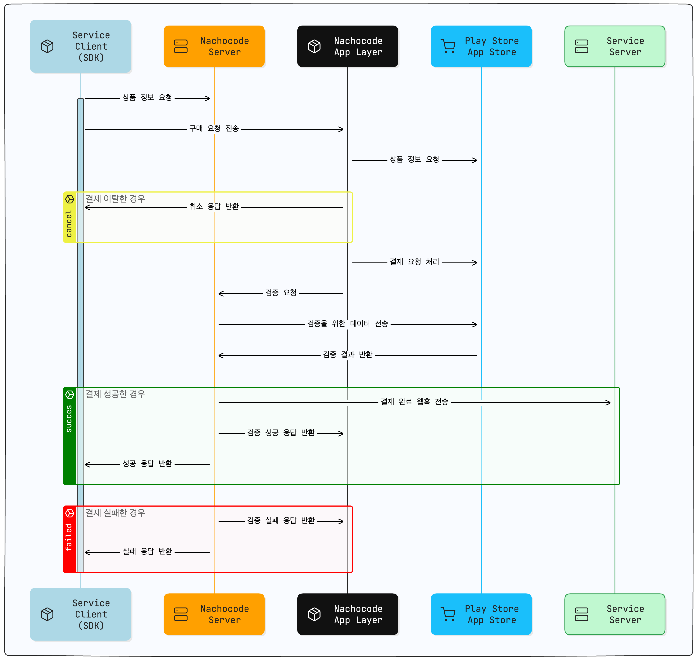

# 인앱 결제

> 🔔 **최신화 일자:** 2025-02-21

인앱결제 구매 성공, 환불 이벤트를 감지하기 위해서는 **웹훅**을 필수적으로 연동하여야 합니다. 웹훅은 위조된 구매 방지를 위한 **검증과정**까지 끝난 이후에만 전송됩니다.
검증과정에서 실패하는 경우 플레이스토어는 환불이 진행되며 앱 스토어는 정책상 고객이 **직접 환불** 요청을 해야합니다.

인앱결제 요청에 의해 생성된 앱 사용자의 로그 데이터는 나쵸코드 대시보드를 통해 확인 및 관리할 수 있습니다.

## **인앱결제 프로세스**

인앱결제는 **Google Play Store** 및 **Apple App Store**를 통해 이루어지며, **구매 요청 → 결제 진행 → 검증 → 상품 지급 → 웹훅 전송**의 흐름으로 진행됩니다.

### 1. 구매 요청

**nachocode Client SDK**를 호출하여 nachocode Server로부터 인앱 상품 정보를 반환받습니다.

상품 정보를 앱으로 전달한 후 스토어에서 상품을 불러옵니다.

디바이스의 네트워크 문제로 인해 스토어와의 연결이 원활하지 않은 경우 인앱 상품을 정상적으로 불러오지 못할 수 있습니다.

상품 로드 이후에 유저가 이탈한 경우 최종 결제 상태는 **결제 이탈**입니다.

### 2. 결제

앱 사용자가 상품 구매 요청을 한 후 결제 프로세스가 진행되는 단계입니다.

앱 사용자의 결제 수단 혹은 네트워크 에러로 인해 결제가 실패할 수 있습니다.

결제가 성공할 경우 **nachocode Server**로 구매에 대한 검증 요청을 수행합니다.

네트워크 에러 혹은 검증 요청이 정상적으로 수행되지 않았을 경우 검증 요청은 앱의 백그라운드 환경에서 재시도 됩니다.

### 3. 검증

앱 사용자가 구매한 상품이 유효한지, 위조된 구매인지 아닌지 서버에서 검증을 수행하는 단계입니다.

플레이 스토어의 경우 검증 과정에서 실패할 경우 환불이 진행됩니다.

앱 스토어의 경우 정책상 개발자가 환불이 **불가능**합니다. nachocode 대시보드에서 iOS의 결제 상태가 **검증 실패**일 경우 아래 [에러 케이스](#인앱결제-에러-케이스)를 확인하여 조치 해주세요.

웹훅 전송은 검증이 **완료된 건에 대해서만** 전송됩니다.

### 4. 웹훅 전송

인앱결제 설정 시 구매 이벤트 웹훅으로 입력한 서버 URL한 웹훅을 전송합니다.

웹훅 전송은 실패할 수 있으며 nachocode 대시보드에서 재전송 할 수 있습니다. 대시보드 내 **인앱결제 > 웹훅 로그**에 접속해 **요청/응답 본문**을 확인할 수 있습니다.

[링크](../guide/webhook/overview)를 통해 **웹훅 정책**을 확인해보세요.

### 5. 상품 지급

웹훅을 정상적으로 수신받을 경우 구매가 완료된 유저에게 상품 권한을 부여하여야 합니다.

이 때 구매를 고유하게 식별하기 위해서는 [이곳](./webhook/iap/purchase#playstorepurchasedata)에 명세된 필드를 고유 식별자로 사용하여야 합니다.  
해당 식별자는 **환불 시에도 동일**하게 사용됩니다. 또한 웹훅 결과에 따른 클라이언트로의 응답반환은 **동기적**으로 이루어집니다.

### 6. 클라이언트 응답 처리

인앱결제 응답에 따른 클라이언트 처리가 필요합니다. 웹훅 수신이 성공적으로 수신되었는지 서버로부터 확인할 수 있습니다.

[링크](../sdk/namespaces/iap#사용-예제-purchase)를 통해 인앱결제 SDK 호출 이후 핸들링 **예시**를 확인할 수 있습니다.

---

## 인앱결제 에러 케이스

### **안드로이드 & 검증 서버 **

안드로이드 인앱결제 응답 코드 문서는 [다음 링크](https://developer.android.com/reference/com/android/billingclient/api/BillingClient.BillingResponseCode)
에서 확인할 수 있습니다.

**샌드박스** 혹은 **운영환경**에서 아래에 명세되지 않은 에러 코드를 수신받을 경우 나쵸코드로 문의해주세요.

| **Code**       | **Message**                                                                    | **Description**                                             | **Solution**                                    |
| -------------- | ------------------------------------------------------------------------------ | ----------------------------------------------------------- | ----------------------------------------------- |
| ERR-NNA-ILA-01 | Failed to connect play store. Invalid response code received.(Code: \{code\})  | 구글 플레이 스토어 연결에 실패한 경우                       | 앱 사용자가 플레이스토어에 로그인 돼있는지 확인 |
| ERR-NNA-ILA-11 | Failed to get product detail. Invalid response code received. (Code: \{code\}) | 플레이 스토어로부터 상품 불러오기가 실패한 경우             | 앱 사용자에게 재시도 요청                       |
| ERR-NNA-ILA-12 | Product not found. Check your product id and product type.                     | nachocode에 등록한 상품이 스토어에 등록돼있지 않은 경우     | 플레이스토어에 인앱 상품 등록                   |
| ERR-NNA-ILA-21 | Failed to purchase. Invalid billing response code received. (Code: \{code\}).  | 결제                                                        | code 확인 후 재시도 요청                        |
| ERR-NNA-ILA-22 | User canceled the purchase.                                                    | 유저가 결제를 취소한 경우                                   | n/a                                             |
| ERR-NNA-ILA-23 | User already owned the product.                                                | 유저가 이미 인앱 상품을 보유중인 경우                       | 상품 숨김 혹은 보유 중 처리                     |
| ERR-NNA-IMA-61 | Purchase state is not valid.                                                   | 유저의 결제 요청이 알 수 없는 이유로 실패한 경우            | 앱 사용자에 재시도 요청                         |
| ERR-AB-PHS-01  | Invalid service key type.                                                      | 나쵸코드에 등록한 안드로이드 서비스 키의 올바르지 않은 경우 | 올바른 정보의 서비스 키 파일로 수정             |

---

### **iOS & 검증 서버 **

**샌드박스** 혹은 **운영환경**에서 아래에 명세되지 않은 에러 코드를 수신받을 경우 나쵸코드로 문의해주세요.

| **Code**       | **Message**                                         | **Description**                              | **Solution**                                                                 |
| -------------- | --------------------------------------------------- | -------------------------------------------- | ---------------------------------------------------------------------------- |
| ERR-NNI-ILA-22 | User cancelled the purchase.                        | 사용자가 결제 진행 중 취소한 경우            | n/a                                                                          |
| ERR-NNI-ILA-21 | Purchase failed due to an error.                    | 결제가 실패한 경우                           | 앱 사용자의 결제 환경 및 정보를 확인                                         |
| ERR-NNI-ILA-12 | Product not found.                                  | 요청한 상품이 App Store에 존재하지 않는 경우 | 앱 스토어에 인앱 상품 등록                                                   |
| ERR-AB-ASS-05  | Something went wrong. Please try again later.       | 결제된 트랜잭션 정보를 불러 올 수 없는 경우  | 1. SDK 샌드박스 설정값 확인 2. 대시보드에 등록된 인앱결제 iOS 관련 설정 확인 |
| ERR-AB-ASS-0e  | The app's iOS certificate information is incorrect. | iOS 빌드시 설정한 정보가 유효하지 않음       | 대시보드에 등록된 iOS 관련 설정 확인                                         |

---

## 추가 정보

인앱결제에 대한 추가 문의사항은 [support@nachocode.io](mailto:support@nachocode.io)로 연락주세요.
