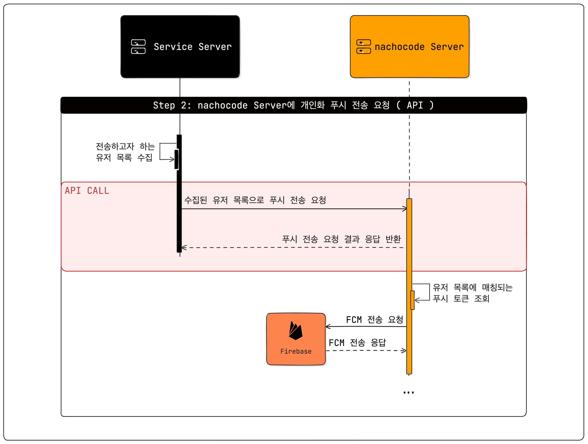

# 개인화 푸시

> 🔔 **최신화 일자:** 2025-03-28

<!-- 2025-03-27 최초 생성 -->

> **📢 참고:**
>
> [`/messages`](../api/push/endpoints.md#post-apipushv2messages)로 끝나는 API 엔드포인트의 경우, 각기 다른 유저에게 다른 제목과 메세지를 전송할 때 사용하고,  
> [`/users`](../api/push/endpoints.md#post-apipushv2users)로 끝나는 API 엔드포인트의 경우, 다수의 유저에게 동일한 제목과 내용을 전송할 때 사용합니다.

 
이 문서는 개인화 푸시 전송에 필요한 **준비 과정**과 **프로세스**에 대해 안내합니다. 

## **개인화 푸시 전송 프로세스**

**[ 프로세스 1 : Push Token 등록 (SDK) ]**

**[ 프로세스 2 : 푸시 전송 (API) ]**

### 1. 선행 작업

나쵸코드 대시보드에서 **Firebase 프로젝트 설정파일 등록** 및 **API Key, Secret Key 발급**이 완료되어야 합니다. 
Firebase 프로젝트 설정파일 등록과 관련된 자세한 내용은 [사용자 가이드](https://docs.nachocode.io/ko/articles/%ED%91%B8%EC%8B%9C-%EC%95%8C%EB%A6%BC%EA%B0%9C%EC%9D%B8%ED%99%94-0eb97bdb) 탭에서 확인 가능합니다.

### 2. Push Token 등록 (SDK)

[nachocode SDK](../sdk/namespaces/push#registerpushtokenuserid-string-promiseany)를 통해 유저별 토큰을 등록합니다.

### 3. Push 전송 API 호출 (API Call)

Server 대 Server [API Call](../api/push/endpoints)을 통해 푸시 전송이 가능합니다.

### 4. 전송 결과 확인 방법

[nachocode](https://nachocode.io) 대시보드 **[앱 기능]** > **[푸시 알림]** > **[개인화 푸시]** 탭에서 푸시 전송 결과 확인이 가능합니다.
