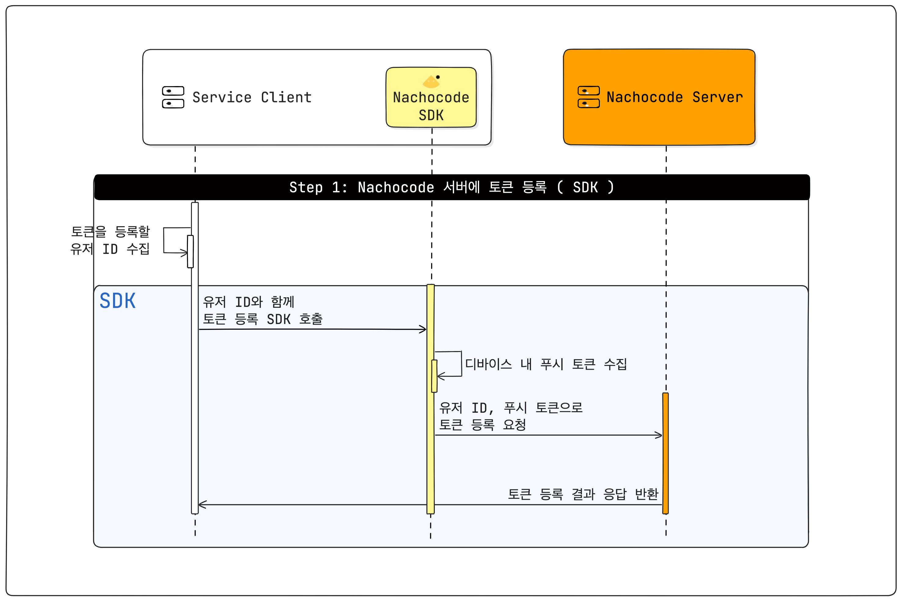
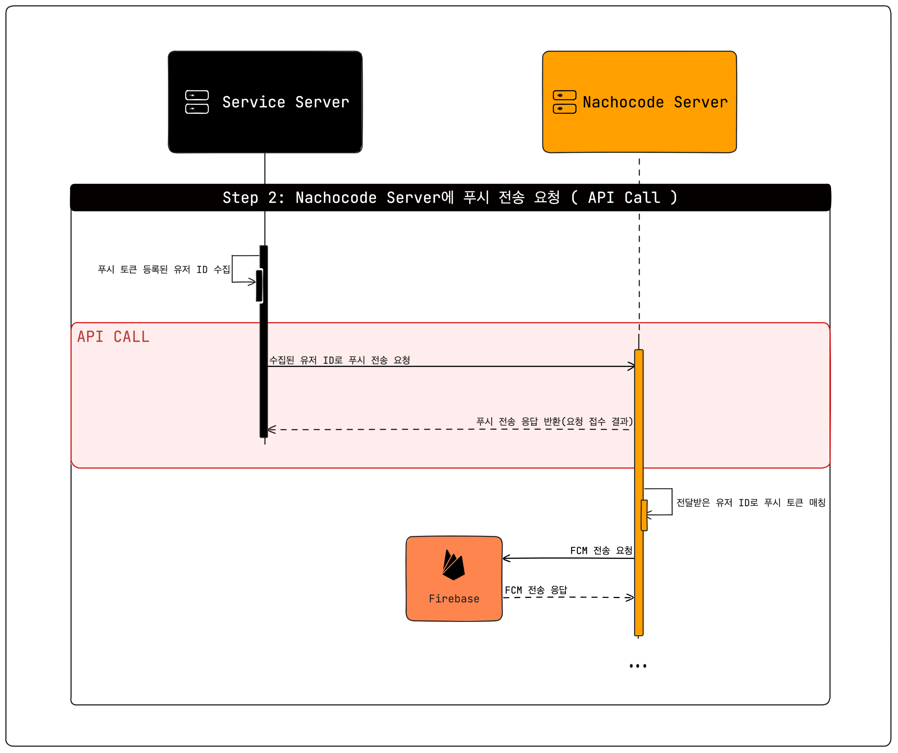

# 개인화 푸시

> 🔔 **최신화 일자:** 2025-06-10

<!-- 2025-03-27 최초 생성 -->
<!-- 2025-06-04 토픽 푸시 추가로 인한 '개인화푸시'-> '푸시알림'탭으로 병합 -->

 
이 문서는 개인화 푸시 전송에 필요한 **준비 과정**과 **프로세스**에 대해 안내합니다.
 

## **개인화 푸시 전송 이해하기**

nachocode의 개인화 푸시 기능은 유저에게 **정교하고 맞춤화된 푸시 알림**을 전송할 수 있도록 해주는 섬세한 기능입니다.  
"**누가 이 알림을 받아햐 하는가?**"를 중심으로 설계되어 전송하고자하는 유저의 모든 기기로 푸시 알림을 전송하기에
유저를 특정할 수 있는 식별자(userId)를 기반으로 nachocode 서버에 등록된 사용자의 모든 디바이스에 전송하는 방식입니다.

뿐만 아니라, 다수의 유저에게 동일한 메시지를 보낼 수도 있고, 각 유저마다 다른 내용의 푸시 메시지를 동적으로 생성하여 전송할 수도 있어 다양한 **개인화 마케팅**과 **기능성 알림 시나리오**에 적합한 도구입니다.

> **📢 참고:**
>
> [`/messages`](../../api/push/v2/endpoints#post-apipushv2messages)로 끝나는 API 엔드포인트의 경우, **각기 다른 유저에게 다른 제목과 메세지를 전송**할 때 사용하고,  
> [`/users`](../../api/push/v2/endpoints#post-apipushv2users)로 끝나는 API 엔드포인트의 경우, **다수의 유저에게 동일한 제목과 내용을 전송**할 때 사용합니다.

 

### 🧐 왜 nachocode 개인화 푸시를 사용해야할까요?

 <b style={{fontSize: "19px"}}>다재다능합니다</b>  

**정확한 대상자**에게만 철저히 **개인화**된 푸시 알림을 전송할 수 있습니다.

**여러명의 유저**에게 **서로 다른 내용**으로 푸시 알림을 **한 번에** 전송할 수 있습니다.  
[`/messages`](../../api/push/v2/endpoints#post-apipushv2messages) API활용을 통해 템플릿을 활용한 개인화된 푸시 알림 전송이 가능합니다.

> To: 나쵸님 - "나쵸님! 새로운 기능이 추가되었어요!"  
> To: 코드님 - "코드님! 새로운 기능이 추가되었어요!"

 

**여러명의 유저**에게 **동일한 내용**으로 푸시 알림을 **한 번에** 전송할 수 있습니다.  
[`/users`](../../api/push/v2/endpoints#post-apipushv2users) API를 활용하여 여러 사람을 타겟으로 동일한 푸시 전송이 가능합니다.

> Message: "새로운 기능이 추가되었어요!"  
> To: 나쵸님, 코드님, ...

  <b style={{fontSize: "19px"}}>누구에게 보낼지만 알려주세요</b>  

유저식별자와 푸시 토큰을 매핑하고 푸시 전송을 수행하는 일련의 과정은 nachocode에서 관리합니다. "**누구**"에게 "**어떤 내용**"을 보낼지만 설정하여 **nachocode API로 요청**하면 푸시 전송이 완료됩니다.

  <b style={{fontSize: "19px"}}>결과를 통한 전략을 수립하세요</b>  

나쵸코드의 전송 결과를 통해 도출되는 여러가지 데이터를 활용하여 **개인화 마케팅 전략 수립**의 강력한 도구로 활용할 수 있습니다.

nachocode에서 제공되는 결과 데이터를 통해 "어떤 상황의 푸시 알림이 고객의 참여를 유도할 수 있는지", "어떤 내용의 푸시에 사용자가 많이 반응했는지" 등의 정보를 도출해낼 수 있습니다. 이러한 데이터를 바탕으로 전략을 수립하여 **사용자의 서비스 만족도를 극대화**시키고, **개인화 마케팅 효과를 극대화**시킬 수 있습니다.

 
 

### 💡 개인화 푸시 활용 방법(예시)

- **고객 세그먼트를 통한 알림 전송**

  - 특정 상품을 구독하고 있는 모든 사용자들에게 공지 알림을 보내고 싶을 때, 해당 사용자들에게 공지 알림을 전송할 수 있습니다.
  - 특정 상품을 관심 등록한 사용자들에게 할인 및 마감 등의 내용으로 알림을 전송하고 싶을 때, 나쵸코드의 개인화 푸시를 이용해 상품 별로 사용자들에게 다른 내용의 푸시 알림을 전송할 수 있습니다.
  - 새로운 상품이 등록됐을 때 해당 카테고리에 관심을 갖고 있던 사용자들에게 상품 입고 알림을 전송할 수 있습니다.
  - 특정 시점에 연령대, 성별 등 사용자들의 정보를 토대로 개인화된 알림을 전송할 수 있습니다.

 

- **이벤트 감지를 통한 알림 전송**

  - 사용자 A가 올린 게시글에 ‘좋아요’가 등록 됐을 때, 사용자 A에게 ‘좋아요’ 등록 알림을 전송할 수 있습니다.
  - 글에 댓글이 생성되었을 때, 글 작성자에게 댓글 알림을 전송할 수 있습니다.

 
 

## **개인화 푸시 전송 프로세스**

**[ 프로세스 1 : 푸시 토큰 등록 (SDK) ]**

**[ 프로세스 2 : 개인화 푸시 전송 (API) ]**

### 1. 선행 작업

나쵸코드 대시보드에서 **1)API Key, Secret Key 발급** 및 **2)Firebase 프로젝트 설정파일 등록**이 완료되어야 합니다.

- **API Key, Secret Key**는 안전하고 원활한 API 통신을 위해 필요한 정보로 나쵸코드 대시보드 **[앱 설정]** > **[개발자 설정]** 탭에서 발급 가능합니다.
- **Firebase 프로젝트 설정 파일 등록**에는 아래와 같은 파일이 요구되며, 자세한 과정과 내용은 [사용자 가이드](https://docs.nachocode.io/ko/articles/%ED%91%B8%EC%8B%9C-%EC%95%8C%EB%A6%BC%EA%B0%9C%EC%9D%B8%ED%99%94-0eb97bdb) 탭에서 확인 가능합니다.

  - Firebase 계정 비공개 키
  - Firebase 프로젝트 안드로이드 앱 생성 시 다운로드 받은 파일(`google-service.json`)
  - Firebase 프로젝트 iOS 앱 생성 시 다운로드 받은 파일(`GoogleService-info.plist`)

 

### 2. 푸시 토큰 등록 ([SDK](../../sdk/namespaces/push#registerpushtokenuserid-string-promiseany))

> :white_check_mark: **유저 식별자만 제공하면, 푸시 토큰을 자동으로 등록합니다.**

 

나쵸코드 서버에서는 유저 식별자와 함께 유저 디바이스의 푸시 토큰을 관리하고, 이를 바탕으로 푸시 전송 요청 시 푸시를 전송할 디바이스를 특정합니다.  
따라서, 개발자가 SDK를 활용하여 **Web Client Side에서 유저 식별자로 푸시 토큰 등록**을 완료하여야만 정상적인 푸시 전송이 가능합니다.

푸시 토큰 등록은 유저를 식별할 수 있는 시점(_ex: 로그인_ )에 [토큰 등록 메서드](../../sdk/namespaces/push#registerpushtokenuserid-string-promiseany) 호출을 통해 진행할 수 있습니다.  
이 후, 제거하고자 하는 시점(_ex: 로그아웃_ )에는 [토큰 삭제 메서드](../../sdk/namespaces/push#deletepushtokenuserid-string-promiseany) 호출을 통해 등록된 토큰을 삭제할 수 있습니다.

 

### 3. 개인화 푸시 전송 ([API](../../api/push/v2/endpoints))

> :white_check_mark: **등록된 유저 식별자만으로 매칭 및 푸시 전송이 이루어집니다.**

 

**동일한 내용**을 **다수의 유저**에게 전송할 시에는 [`/users`](../../api/push/v2/endpoints#post-apipushv2users) API Endpoint를 사용하고,  
**각 유저마다 다른 내용**을 전송할 시에는 [`/messages`](../../api/push/v2/endpoints#post-apipushv2messages) API Endpoint를 사용합니다.

API 호출은 Server 대 Server 요청을 통해 이루어지므로, 푸시 전송 시점을 선정하여 개발자가 **Server Side 로직에 추가**하여야 합니다.  
**전송하고자 하는 내용**과 대시보드에서 발급받은 **API Key, Secret Key**로 요청 데이터를 구성하여 상황에 맞는 API Endpoint로 푸시 전송을 요청할 수 있습니다.

푸시 전송 요청이 nachocode server로 전달되면 토큰-유저식별자 매칭 과정을 거쳐 FCM으로의 요청을 수행하고, 완료된 FCM의 결과에 따른 히스토리를 관리합니다.

 

### 4. 전송 결과 확인

각 푸시 요청의 **히스토리**와 **성공 및 실패** 여부 이 외에도 **전송률**, **도달률**, **클릭률**과 같이 다양한 통계 데이터를 제공합니다. 이를 통해, 각 푸시의 효과를  
분석하여 전략 수립에 활용할 수 있습니다.

푸시 요청에 대한 상세 정보는 [nachocode](https://nachocode.io/?utm_source=docs&utm_medium=documentation&utm_campaign=devguide) 대시보드의 **[앱 기능]** > **[푸시 알림]** > **[개인화 푸시]** 탭에서 확인할 수 있습니다.
