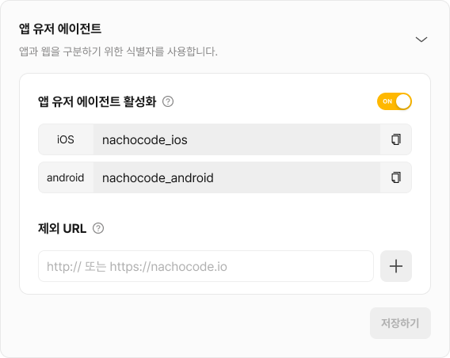

# User Agent 설정하기

> 🔔 **최신화 일자:** 2025-05-30

## nachocode User Agent

**앱에서 발생한 요청을 식별**할 수 있도록 nachocode에서는 앱 사용자의 **User Agent 정보에 앱 정보를 추가하는 기능**을 제공하고 있습니다.

[**nachocode 대시보드에서 앱 User Agent를 설정**](#user-agent-설정-방법)한 후에 빌드된 앱은 플랫폼에 따라 다음과 같은 **고정된 문자열을 User Agent에 삽입**합니다.

| 플랫폼  | 삽입되는 문자열     |
| ------- | ------------------- |
| Android | `nachocode_android` |
| iOS     | `nachocode_ios`     |

---

> 📢 **참고**:
>
> **User Agent는 nachocode 앱을 통해 웹 페이지에 진입한 경우에만 설정되며**,
>
> **일반 브라우저 또는 외부 앱에서는 설정되지 않습니다.**

---

### 설정 후 User Agent 예시

**Android**:

```plain-text
Mozilla/5.0 ... (중략) ... nachocode_android
```

**iOS**:

```plain-text
Mozilla/5.0 ... (중략) ... nachocode_ios
```

---

### 제외 URL 정책

일부 외부 서비스(결제 시스템, OAuth 인증 등)에서는 nachocode의 User Agent로 인해 예상치 못한 렌더링 오류나 기능 비정상이 발생할 수 있습니다. 이를 방지하기 위해 nachocode는 **제외 URL(Exclusion URL)** 기능을 제공합니다.

#### **제외 URL이란?**

**등록된 특정 URL 또는 도메인**에 대해서는 User Agent(`nachocode_android` / `nachocode_ios`)를 삽입하지 않고, **디바이스의 기본 User Agent만을 사용하도록 예외처리**하는 기능입니다.

**예외처리는 다음과 같은 경우**에 유용하게 사용됩니다 :

- 외부 결제 창 연동 시 WebView 호환성 확보
- 소셜 로그인 페이지 등 민감한 외부 웹 자원 호출
- 서드파티 위젯/스크립트가 User Agent에 의존하지 않는 환경

---

### User Agent 설정 방법

#### 1. [nachocode 대시보드](https://nachocode.io/?utm_source=docs&utm_medium=documentation&utm_campaign=devguide)의 [ 앱 설정 > 개발자 설정 > 앱 유저 에이전트 활성화 ]에서 [ 앱 유저 에이전트 활성화 ] 토글을 활성화



#### 2. 커스텀 유저 에이전트를 사용하지 않을 **제외 URL**을 추가한 후 저장하기

---

### User Agent 활용 방법

nachocode의 Custom User Agent는 **Google Analytics(GA)** 와 같은 웹 분석 도구에서 nachocode 앱에서 발생한 요청을 식별하는 데 활용할 수 있습니다.

예시로 GA에서는 다음과 같은 **앱 사용자 분석 및 트래킹**이 가능합니다.

- **nachocode 앱에서 발생한 웹 요청을 식별하여 사용자 세그먼트 구성**
- **앱 플랫폼(Android/iOS)에 따라 분석 필터링 적용**
- **웹 유저와 앱 유저의 행동 분석을 분리하여 시각화**
- **GA 커스텀 파라미터 또는 사용자 속성(user_properties)을 이용해 유저 그룹 세분화**

---

### 추가 정보

**GA 연동을 위한 스크립트 구성, 커스텀 파라미터 설정** 등은 **GA 연동 유저 가이드 문서**를 참고해주세요.

➡️ [**GA 연동 가이드**](https://docs.nachocode.io/ko/articles/GA4-%EC%97%B0%EB%8F%99-c7823729)

추가로 궁금한 점이 있다면 [support@nachocode.io](mailto:support@nachocode.io)로 문의해주세요.
