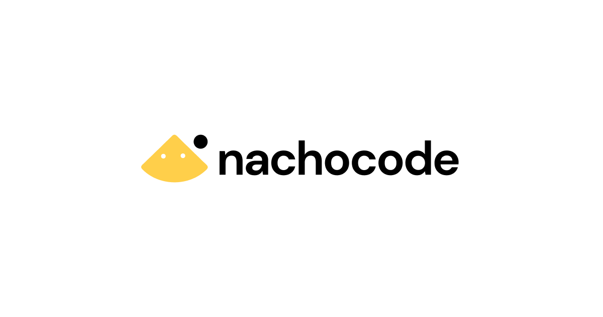
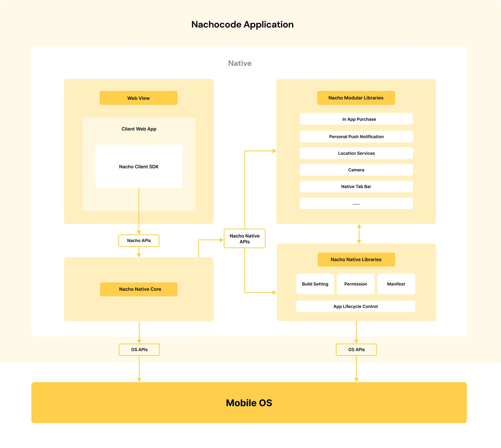

# nachocode 서비스 소개

> 🔔 **최신화 일자:** 2025-07-04

**nachocode**는 비개발자와 웹 개발자 모두를 위한 강력한 **노코드 & 로우코드 앱 빌드 플랫폼**입니다.  
nachocode를 사용하면 비개발자도 간단한 설정만으로 네이티브 앱을 생성할 수 있으며, 웹 개발자는 SDK와 API를 통해 고도화된 네이티브 앱을 구현할 수 있습니다.

:::info 대시보드 바로가기
➡️ [nachocode 대시보드 바로가기](https://nachocode.io/?utm_source=docs&utm_medium=documentation&utm_campaign=devguide)
:::

---

## nachocode 앱 구조

nachocode에서 빌드한 앱들은 위 구조를 통해 앱 사용자들에게 다양한 기능을 제공할 수 있게 설계돼있습니다.

nachocode를 활용하여 만들어진 네이티브 앱들은 nachocode Client SDK를 통해 웹 클라이언트에서 **Nacho Native APIs**에 접근할 수 있습니다.

:::info 나쵸코드 앱 자세히 살펴보기
➡️ [nachocode 앱소스 가이드](/docs/guide/app-source)를 통해 나쵸코드 앱을 자세히 살펴보세요.
:::

---

## nachocode의 주요 서비스

### 1. **노코드 앱 빌드 플랫폼**

nachocode의 **노코드 대시보드**를 통해 누구나 쉽고 빠르게 Android 및 iOS 앱을 생성할 수 있습니다.  
웹사이트 주소만 입력하면 즉시 앱으로 빌드가 가능하며, 대시보드를 통해 다양한 앱 기능을 손쉽게 설정할 수 있습니다.

:::info 대시보드 체험하기
➡️ [nachocode 대시보드 체험하기](https://nachocode.io/?utm_source=docs&utm_medium=documentation&utm_campaign=devguide)
:::

#### **대시보드 주요 기능**

- **앱 정보 설정**: 서비스에 맞춰 앱 아이콘과 이름을 자유롭게 변경할 수 있습니다.
- **스플래시 이미지 설정**: 앱의 시작 화면을 커스터마이징할 수 있습니다.
- **탭바 구성**: 앱의 하단 탭바를 시각적으로 구성하고 관리합니다.
- **푸시 알림 설정**: 비개발자도 클릭 몇 번으로 푸시 알림 기능을 활성화할 수 있습니다.

### 2. **로우코드 개발자 도구 (SDK 및 API)**

nachocode는 웹 개발자들이 네이티브 앱의 고급 기능을 활용할 수 있도록 **SDK**와 **API**를 제공합니다.  
이 도구들은 nachocode에서 이미 구축한 다양한 네이티브 기능을 간단히 통합하고 확장할 수 있는 방법을 제공합니다.

- **nachocode Client SDK**:

  - 네이티브 기능(생체 인증, 진동, 내부 브라우저 등)을 웹 앱에 통합 가능
  - 간단한 인터페이스로 개발 속도 향상
  - [nachocode SDK 문서 바로가기](./sdk/intro)

- **nachocode API**:
  - 대량의 푸시 알림 전송 등을 서버 대 서버 요청으로 실행 가능
  - 사용자 맞춤형 메시지와 이벤트 트리거
  - [nachocode API 문서 바로가기](./api/intro)

---

## nachocode Client SDK의 특징

nachocode Client SDK는 웹 개발자들이 네이티브 앱 개발의 진입 장벽을 낮출 수 있도록 다양한 기능을 제공합니다.

### **SDK 주요 기능**

1. **네이티브 앱의 기본 기능**

   - 진동 및 햅틱 피드백, 생체 인증, QR 리더기 등 다양한 네이티브 기능 제공
   - 권한 요청 시점 제어 및 앱 실행 상태(포그라운드/백그라운드) 감지 지원

2. **유저 경험(UX) 강화 기능**

   - 개인화 푸시 알림으로 맞춤형 사용자 경험 제공
   - 네이티브 공유 인터페이스를 통해 OS 기본 공유 기능 활용

3. **앱 정보와 리소스 관리**
   - 내부/외부 브라우저 제어 및 디바이스/앱 정보 확인 가능
   - 앱 내부 저장소를 활용한 데이터 저장 및 관리

nachocode Client SDK를 활용하면 웹 개발자가 네이티브 앱을 제어하고 사용자 경험을 강화하는 데 필요한 모든 기능을 손쉽게 통합할 수 있습니다.

:::info SDK 기능 살펴보기
➡️ [nachocode Client SDK 기능 살펴보기](./sdk/intro)
:::

---

## nachocode API의 특징

nachocode API는 앱 서비스와 사용자 데이터를 효율적으로 관리하고 확장할 수 있도록 설계된 강력한 인터페이스를 제공합니다.

### **API 주요 기능**

1. **개인화 푸시 API**
   - 개인화된 메시지를 유저 ID로 조회된 모든 푸시 토큰에 전송
   - 일괄 전송 및 개별 메시지 전송 지원
   - 전송 성공 및 실패 결과 관리 기능 제공

nachocode API는 현재 푸시 알림 전송에 중점을 두고 있으며, 앞으로 다양한 API 기능이 추가될 예정입니다.

:::info API 기능 살펴보기
➡️ [nachocode API 기능 살펴보기](./api/intro)
:::

---

## nachocode의 장점

nachocode는 비개발자와 개발자 모두를 위한 플랫폼으로, 앱 개발을 더 쉽고 빠르게 만듭니다.  
nachocode의 **노코드 대시보드와 로우코드 개발자 도구**로 고도화된 앱을 개발해보세요.

### 1. **비개발자를 위한 간단한 노코드 대시보드**

nachocode 대시보드는 직관적인 인터페이스로 구성되어 있어, 비개발자도 클릭 몇 번으로 앱을 빌드하고 필요한 기능을 추가할 수 있습니다.  
어려운 프로그래밍 과정 없이도 앱의 스플래시 화면, 탭바, 푸시 알림 등을 손쉽게 설정할 수 있습니다.

:::info 대시보드 체험하기
➡️ [nachocode 대시보드 체험하기](https://nachocode.io/?utm_source=docs&utm_medium=documentation&utm_campaign=devguide)
:::

### 2. **개발자를 위한 강력한 SDK와 API**

nachocode SDK와 API는 다음과 같은 특징으로 개발자를 지원합니다:

- **빠르고 간단한 통합**: SDK와 API를 활용해 몇 줄의 코드만으로 네이티브 앱 기능을 구현할 수 있습니다.
- **다양한 네이티브 기능 제공**: 생체 인증, 진동, 내부 저장소, 브라우저 컨트롤 등 웹 개발 환경에서는 접근하기 어려운 기능을 제공합니다.
- **고급 기능 확장 가능**: 기본 제공 기능 외에도 맞춤형 기능을 추가하거나 확장할 수 있습니다.

### 3. **앱 개발 속도 향상**

nachocode는 이미 구축된 네이티브 기능과 직관적인 도구를 통해 개발자들이 빠르게 앱을 배포할 수 있도록 지원합니다.  
특히 반복적인 작업과 복잡한 개발 과정을 줄여, 더 중요한 비즈니스 로직에 집중할 수 있습니다.

### 4. **낮은 진입 장벽**

웹 개발자는 nachocode를 통해 네이티브 앱 개발의 복잡성을 크게 줄일 수 있습니다.  
비개발자는 대시보드와 기본 제공 기능을 활용해 전문적인 기술 없이도 완성도 높은 앱을 제작할 수 있습니다.

---

nachocode와 함께 혁신적인 앱 개발을 시작하세요!  
궁금한 점이 있다면 [support@nachocode.io](mailto:support@nachocode.io)로 언제든 문의해 주세요. 🚀
