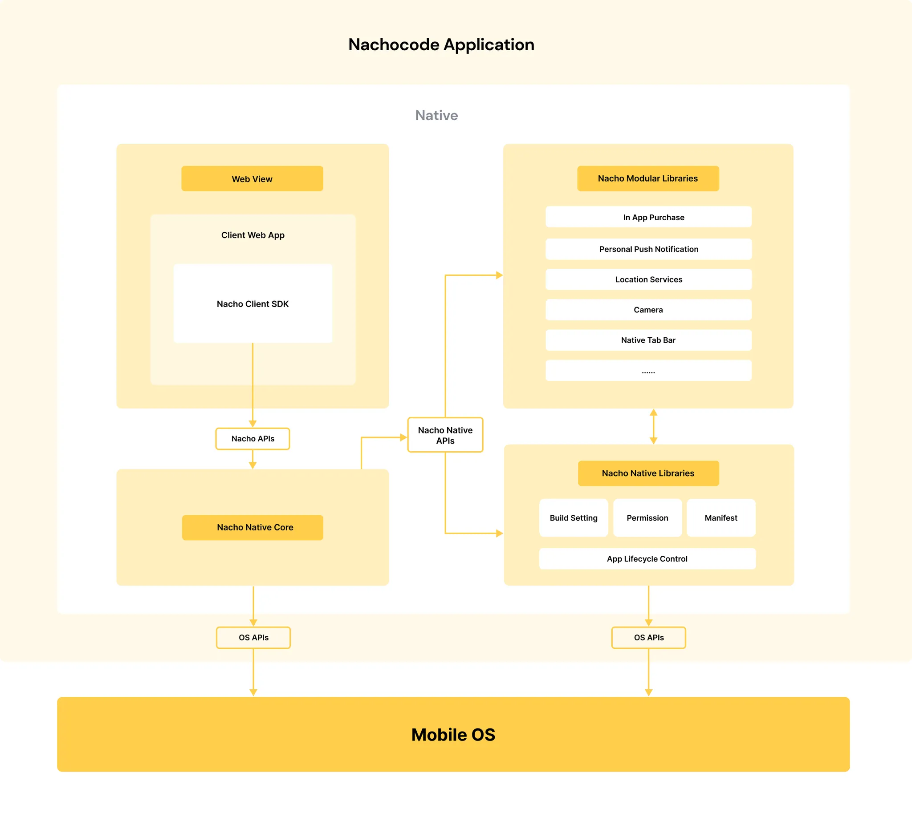

# nachocode SDK 개요

> 🔔 **최신화 일자:** 2025-02-24

**nachocode JavaScript 클라이언트 SDK**는 웹 클라이언트 개발자가 네이티브 앱 개발을 할 수 있도록 돕는 다양한 기능을 제공합니다.

**nachocode SDK**를 활용하면 다양한 네이티브 기능에 접근할 수 있으며, 웹 애플리케이션에서도 손쉽게 모바일 디바이스의 고유 정보를 활용할 수 있습니다.

이 문서는 **SDK의 설치, 초기화, 주요 기능 및 사용 방법** 등을 안내합니다.

---

## 문서 구조

nachocode SDK 문서는 아래와 같은 구조로 구성되어 있습니다:

1. **SDK 개요**  
   nachocode SDK의 주요 기능과 개념에 대한 설명을 제공합니다.

2. **시작하기**  
   nachocode SDK를 웹 클라이언트에 설치하고 설정하는 방법을 안내합니다.  
   ➡️ [시작하기 가이드](./getting-started.md)

3. **네임스페이스별 문서**  
   nachocode SDK의 각 네임스페이스(`app`, `authentication`, `device` 등)에 대한 상세한 문서와 사용법을 제공합니다.

---

## nachocode 앱 구조

nachocode에서 빌드한 앱들은 위 구조를 통해 앱 사용자들에게 다양한 기능을 제공할 수 있게 설계돼있습니다.

**nachocode SDK**를 이용해 앱 사용자들에게 네이티브 앱 경험을 제공하세요!

---

## 시작하기

nachocode SDK를 처음 사용하시나요?  
➡️ [시작하기 가이드](./getting-started.md)를 확인하여 SDK 설치 및 초기화를 진행하세요.

---

## 지원 플랫폼

- Android
- iOS
- Web

---

## 주요 기능

nachocode SDK는 다음과 같은 기능을 제공합니다:

### 1. **앱 정보 관리 (`app`)**

애플리케이션 이름, 버전, 패키지 이름 등의 정보를 제공합니다.  
➡️ [앱 네임스페이스](./namespaces/app.md)

### 2. **애플 소셜 기능 (`apple`)**

Apple 계정을 통한 소셜 로그인 기능을 네이티브로 제공합니다.  
➡️ [Apple 네임스페이스](./namespaces/apple.md)

### 3. **사용자 인증 (`authentication`)**

생체 인증(Fingerprint/Face ID) 등 다양한 인증 수단을 제공합니다.  
➡️ [인증 네임스페이스](./namespaces/authentication.md)

- **사용자 인증**: 생체 인증 및 권한 확인 기능을 제공합니다.

### 4. **네이티브 백 키 제어 (`backkey`)**

Android 디바이스의 네이티브 백 키 이벤트를 제어할 수 있습니다.  
➡️ [백 키 네임스페이스](./namespaces/backkey.md)

### 5. **브라우저 기능 (`browser`)**

외부 브라우저 또는 내부 브라우저로 URL을 열 수 있는 기능을 제공합니다.  
➡️ [브라우저 네임스페이스](./namespaces/browser.md)

### 6. **클립보드 관리 (`clipboard`)**

텍스트를 클립보드에 복사하거나 읽을 수 있습니다.  
➡️ [클립보드 네임스페이스](./namespaces/clipboard.md)

### 7. **디바이스 정보 및 상태 확인 (`device`)**

디바이스 모델, OS 버전, 배터리 상태, 네트워크 상태, 언어 코드 등을 확인할 수 있습니다.  
➡️ [디바이스 네임스페이스](./namespaces/device.md)

### 8. **환경 설정 및 실행 상태 관리 (`env`)**

SDK 초기화 상태, 실행 환경(웹/앱) 등을 확인할 수 있습니다.  
➡️ [환경 네임스페이스](./namespaces/env.md)

### 9. **이벤트 관리 (`event`)**

초기화, 포그라운드/백그라운드 전환, 네트워크 상태 변경 등의 이벤트를 처리합니다.  
➡️ [이벤트 네임스페이스](./namespaces/event.md)

### 10. **페이스북 소셜 기능 (`facebook`)**

Facebook 계정을 통한 소셜 로그인 기능을 제공합니다.  
➡️ [Facebook 네임스페이스](./namespaces/facebook.md)

### 11. **인앱결제 기능 (`iap`)**

Android 및 iOS 환경에서 네이티브 인앱결제를 손쉽게 처리할 수 있습니다.  
➡️ [인앱결제 네임스페이스](./namespaces/iap.md)

### 12. **디바이스 권한 제어 (`permission`)**

카메라, 위치, 푸시 알림 등 디바이스 권한을 요청하고 상태를 확인할 수 있습니다.  
➡️ [권한 네임스페이스](./namespaces/permission.md)

### 13. **내부 저장소 데이터 관리 (`preference`)**

애플리케이션 내부 저장소를 통해 데이터를 저장 및 관리합니다.  
➡️ [내부 저장소 네임스페이스](./namespaces/preference.md)

### 14. **푸시 알림 관리 (`push`)**

푸시 알림 토큰을 관리하고 nachocode 서버에 등록할 수 있습니다.  
➡️ [푸시 네임스페이스](./namespaces/push.md)

### 15. **스캔 기능 (`scanner`)**

QR 코드 스캔 및 기타 스캔 기능을 제어할 수 있습니다.  
➡️ [스캐너 네임스페이스](./namespaces/scanner.md)

### 16. **설정 (`setting`)**

'Pull to Refresh'와 같은 새로고침 동작과 화면 확대 기능 등을 설정할 수 있습니다.  
➡️ [설정 네임스페이스](./namespaces/setting.md)

### 17. **네이티브 공유 기능 (`share`)**

네이티브 공유 UI를 통해 URL을 공유할 수 있습니다.  
➡️ [공유 네임스페이스](./namespaces/share.md)

### 18. **탭바 제어 (`tabbar`)**

앱 내부 탭바의 표시 여부 및 이동을 제어할 수 있습니다.  
➡️ [탭바 네임스페이스](./namespaces/tabbar.md)

### 19. **진동 및 햅틱 피드백 (`vibration`)**

디바이스의 진동 및 햅틱 피드백을 트리거할 수 있습니다.  
➡️ [진동 네임스페이스](./namespaces/vibration.md)

---

## **마무리**

nachocode SDK는 **웹 애플리케이션에서 네이티브 기능을 손쉽게 통합**할 수 있도록 설계되었습니다.  
지속적인 업데이트를 통해 **더 많은 기능과 향상된 개발 경험**을 제공할 예정입니다.

nachocode SDK와 함께 **웹과 네이티브의 경계를 허물고** 더욱 혁신적인 애플리케이션을 개발해보세요! 🚀

> 📖 nachocode 팀은 여러분의 성공적인 프로젝트 구현을 위해 항상 도움을 준비하고 있습니다. 기술적인 질문이나 피드백이 있다면 언제든지 [이메일](mailto:support@nachocode.io)을 보내주세요.

---
