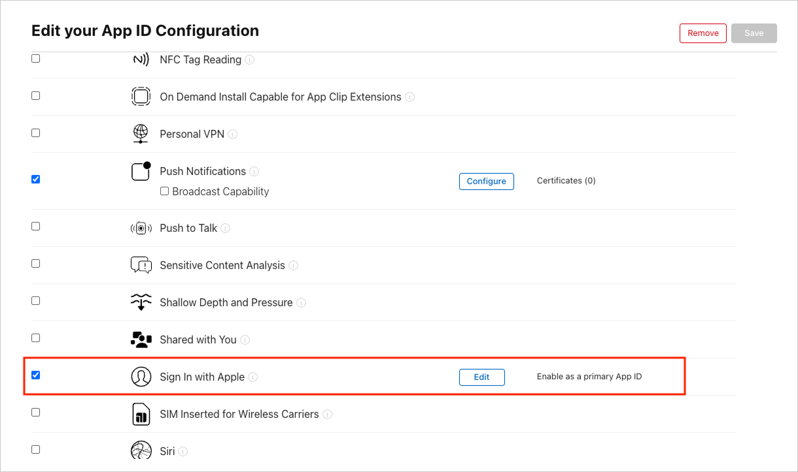

# 애플 (`apple`)

> 🔔 **최신화 일자:** 2025-04-24


## **개요**

`apple` 네임스페이스는 **디바이스의 Apple 네이티브 기능**을 활용할 수 있도록 지원합니다.  
현재는 **Apple 로그인** 및 **사용자 정보 조회** 기능을 제공합니다.

> ⚠️ **이 네임스페이스는 현재 iOS에서만 지원됩니다.**

---

### **필수 선행 작업**

nachocode SDK로 **애플 네이티브 기능**을 사용하기 위해서는 아래 사항이 먼저 완료되어야 합니다.

#### 1. [Apple Developer](https://developer.apple.com/account/resources/identifiers/list)에서 **Identifier**에 Capabilities 중 [ Sign In with Apple ] 추가



<br/>

#### 2. [nachocode 대시보드](https://nachocode.io)의 [ 앱 설정 > 개발자 설정 ]에서 [ 애플 로그인 ] 토글을 활성화하여 앱 설정 완료


- _(대시보드 5월 업데이트 예정) 지금 사용을 희망하시는 경우 [support@nachocode.io](mailto:support@nachocode.io)로 문의 바랍니다._

---

## **타입 정의**

### **`AppleResult`**

Apple 로그인 요청의 결과 상태를 나타내는 객체 타입입니다.

| 필드                     | 타입     | 설명                                 |
| ------------------------ | -------- | ------------------------------------ |
| `status`                 | `string` | 요청 결과 상태 (`success` / `error`) |
| `errorCode` (_optional_) | `string` | 오류 코드 (선택적)                   |
| `message` (_optional_)   | `string` | 오류 메시지 (선택적)                 |

---

### **`ApplePermissionTypes`**

Apple 로그인 요청 시 요구할 수 있는 권한 목록입니다.

| 값         | 설명                  |
| ---------- | --------------------- |
| `email`    | 사용자 이메일 정보    |
| `fullName` | 사용자 전체 이름 정보 |

---

### **`AppleUserData`**

Apple 로그인 성공 시 반환되는 사용자 정보 객체입니다.

| 필드                           | 타입     | 설명                        |
| ------------------------------ | -------- | --------------------------- |
| `identifier`                   | `string` | Apple 사용자 고유 식별자    |
| `token`                        | `string` | 사용자 토큰                 |
| `authorizationCode`            | `string` | Apple 인증 코드             |
| `email` (_optional_)           | `string` | 사용자 이메일 (선택적)      |
| `name.familyName` (_optional_) | `string` | 사용자 성                   |
| `name.givenName` (_optional_)  | `string` | 사용자 이름                 |
| `[fields: string]`             | `any`    | 기타 사용자 데이터 (선택적) |

---

## **메서드 목록**

| 메서드                                                                                                                             | 설명                                     | 추가된 버전 |
| ---------------------------------------------------------------------------------------------------------------------------------- | ---------------------------------------- | ----------- |
| [`login(permissions, callback)`](#loginpermissions-applepermissions-callback-result-appleresult-userdata-appleuserdata--void-void) | Apple 네이티브 소셜 로그인을 수행합니다. | ver.1.4.0   |
| [`isLoggedIn(identifier, callback)`](#isloggedinidentifier-string-callback-result-appleresult-isloggedin-boolean--void-void)       | Apple 로그인 상태를 확인합니다.          | ver.1.4.0   |
| [`getUserIdentifier(callback)`](#getuseridentifiercallback-result-appleresult-useridentifier-string--void-void)                    | Apple 사용자 고유 식별자를 반환합니다.   | ver.1.4.0   |

---

## **메서드 상세**

### **`login(permissions: ApplePermissions, callback: (result: AppleResult, userData?: AppleUserData) => void): void`**

- _since ver.1.4.0_
- 📢 _[필수 선행 작업](#필수-선행-작업)이 완료되어야 사용할 수 있습니다._

#### 설명 (`login`)

Apple 네이티브 소셜 로그인을 수행하고 사용자 정보를 반환합니다.

#### 매개변수 (`login`)

| 이름          | 타입                                                      | 필수 여부 | 설명                                    |
| ------------- | --------------------------------------------------------- | --------- | --------------------------------------- |
| `permissions` | `ApplePermissions`                                        | ✅        | 로그인 요청 시 요구할 권한 목록         |
| `callback`    | `(result: AppleResult, userData?: AppleUserData) => void` | ✅        | 요청 결과와 사용자 정보를 반환하는 함수 |

#### 반환 값 (`login`)

해당 메서드는 반환 값을 가지지 않으며, 결과는 `callback`을 통해 비동기적으로 제공됩니다.

#### 사용 예제 (`login`)

```javascript
// Apple 로그인 요청
Nachocode.apple.login(['email', 'fullName'], (result, userData) => {
  if (result.status === 'success') {
    console.log('Apple 로그인 성공:', userData);
    console.log('토큰:', userData.token);
    console.log('인가코드:', userData.authorizationCode);
    console.log('이메일:', userData.email);
    console.log('성:', userData.name?.familyName);
    console.log('이름:', userData.name?.givenName);
  } else {
    console.error(`Apple 로그인 실패: ${result.message}`);
  }
});
```

---

### **`isLoggedIn(identifier: string, callback: (result: AppleResult, isLoggedIn: boolean) => void): void`**

- _since ver.1.4.0_
- 📢 _[필수 선행 작업](#필수-선행-작업)이 완료되어야 사용할 수 있습니다._

#### 설명 (`isLoggedIn`)

Apple 사용자 고유 식별자(`identifier`)를 기반으로 현재 사용자가 로그인 상태인지 확인합니다.

#### 매개변수 (`isLoggedIn`)

| 이름         | 타입                                                 | 필수 여부 | 설명                        |
| ------------ | ---------------------------------------------------- | --------- | --------------------------- |
| `identifier` | `string`                                             | ✅        | Apple 사용자 고유 식별자    |
| `callback`   | `(result: AppleResult, isLoggedIn: boolean) => void` | ✅        | 로그인 여부를 반환하는 함수 |

#### 반환 값 (`isLoggedIn`)

해당 메서드는 반환 값을 가지지 않으며, 결과는 `callback`을 통해 비동기적으로 제공됩니다.

#### 사용 예제 (`isLoggedIn`)

```javascript
// Apple 로그인 상태 확인
Nachocode.apple.isLoggedIn('user_identifier_here', (result, isLoggedIn) => {
  console.log('조회 성공 여부:', result.status);
  if (isLoggedIn) {
    console.log('사용자는 현재 Apple에 로그인되어 있습니다.');
  } else {
    console.log('Apple 로그인이 되어 있지 않습니다.');
  }
});
```

---

### **`getUserIdentifier(callback: (result: AppleResult, userIdentifier?: string) => void): void`**

- _since ver.1.4.0_
- 📢 _[필수 선행 작업](#필수-선행-작업)이 완료되어야 사용할 수 있습니다._

#### 설명 (`getUserIdentifier`)

Apple 사용자 고유 식별자를 반환합니다.

#### 매개변수 (`getUserIdentifier`)

| 이름       | 타입                                                     | 필수 여부 | 설명                                |
| ---------- | -------------------------------------------------------- | --------- | ----------------------------------- |
| `callback` | `(result: AppleResult, userIdentifier?: string) => void` | ✅        | Apple 사용자 식별자를 반환하는 함수 |

#### 반환 값 (`getUserIdentifier`)

해당 메서드는 반환 값을 가지지 않으며, 결과는 `callback`을 통해 비동기적으로 제공됩니다.

#### 사용 예제 (`getUserIdentifier`)

```javascript
// Apple 사용자 고유 식별자 조회
Nachocode.apple.getUserIdentifier((result, userIdentifier) => {
  if (result.status === 'success') {
    console.log(`사용자 식별자: ${userIdentifier}`);
  } else {
    console.error(`사용자 식별자 조회 실패: ${result.message}`);
  }
});
```

---

## **추가 정보**

- Apple 네임스페이스는 **현재 iOS에서만 동작**합니다. Android 및 기타 환경에서는 추후 지원될 예정입니다.
- 사용자의 이메일 및 이름 정보는 최초 로그인 시에만 제공될 수 있으며, 이후 재로그인 시 반환되지 않을 수 있습니다.

---
