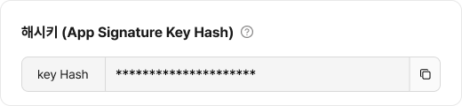
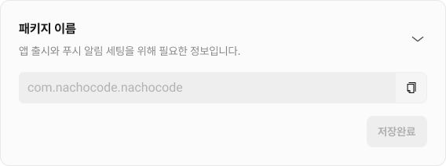
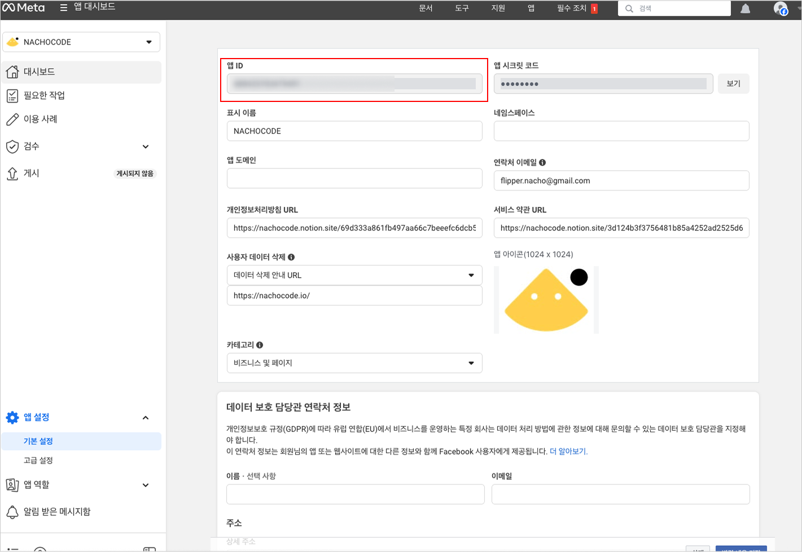
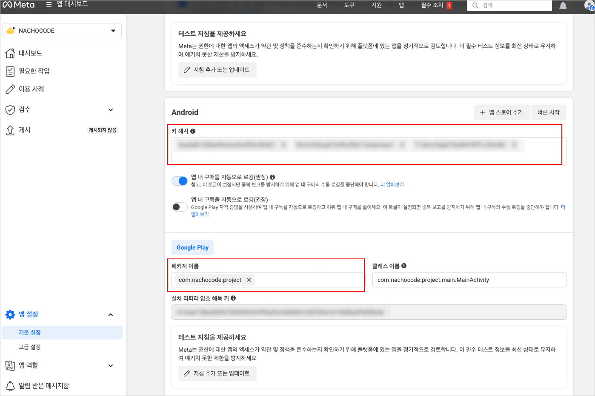
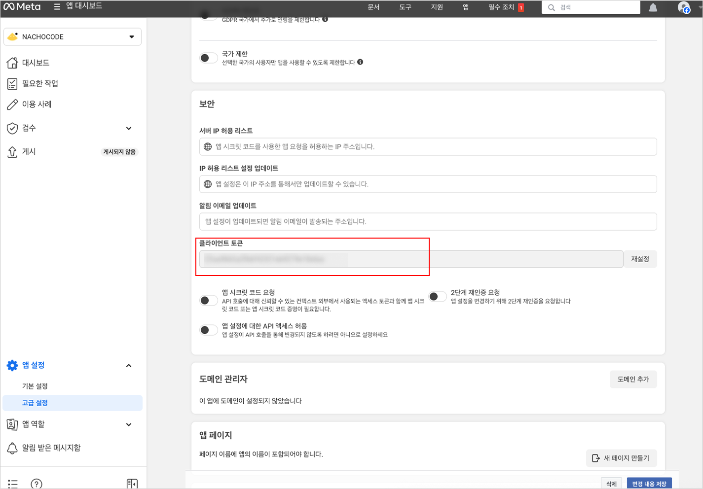
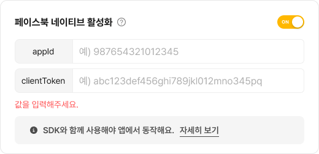
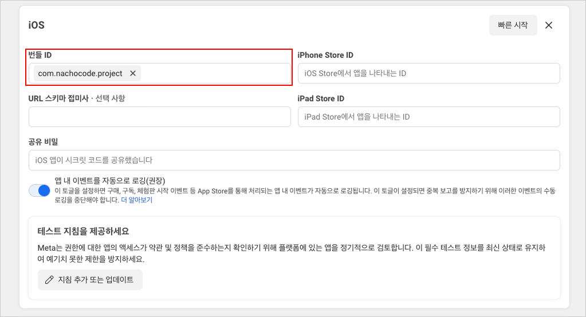
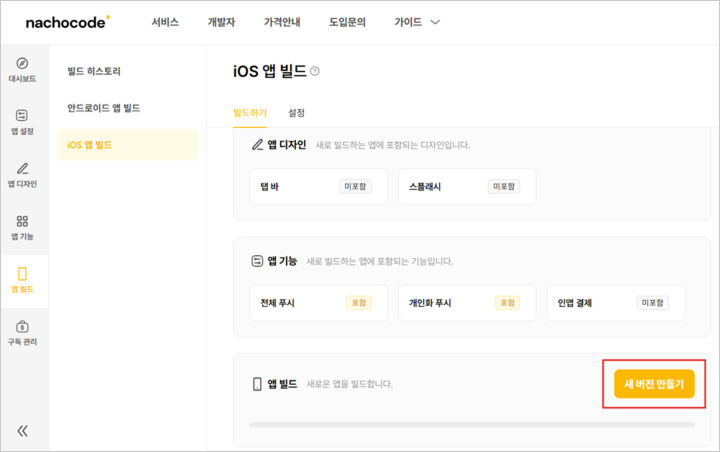

# 페이스북 (`facebook`)

> 🔔 **최신화 일자:** 2025-06-20

## **개요**

`facebook` 네임스페이스는 **페이스북 네이티브 로그인 기능을 제공**하며, 사용자는 **페이스북 계정을 통해 인증**할 수 있습니다.

이 네임스페이스를 사용하여 **로그인, 사용자 정보 조회, 로그아웃**과 같은 기능을 수행할 수 있습니다.  
지원되는 **권한(permissions)** 목록은 [페이스북 권한 공식 문서](https://developers.facebook.com/docs/permissions)에서 확인할 수 있습니다.

---

## 필수 선행 작업

nachocode SDK로 **페이스북 네이티브 기능**을 사용하기 위해서는 아래 사항이 먼저 완료되어야 합니다.

### 안드로이드 설정

#### 1. [nachocode 대시보드](https://nachocode.io/?utm_source=docs&utm_medium=documentation&utm_campaign=devguide)의 [ 앱 설정 > 개발자 설정 > 안드로이드 네이티브 설정 ]에서 [해시키](https://developers.google.com/android/guides/client-auth?hl=ko) 확인{#facebook-android-1}



<br/>

#### 2. [nachocode 대시보드](https://nachocode.io/?utm_source=docs&utm_medium=documentation&utm_campaign=devguide)의 [ 앱 설정 > 고급 설정 > 패키지 이름 ]에서 패키지 이름 확인{#facebook-package-name}



<br/>

#### 3. [Facebook Developer](https://developer.facebook.com)의 [ 앱 설정 > 기본 설정 ]에서 앱을 등록하고 정보 입력

- **`앱 ID`는 [nachocode 대시보드 설정](#facebook-android-nachocode) 시 필요합니다.**



<br/>

#### 4. [1. 해시키 확인](#facebook-android-1)에서 복사한 **해시키** 와 [2. 패키지 이름 확인](#facebook-package-name)에서 복사한 **패키지 이름** 등록


<br/>

#### 5. [Facebook Developer](https://developer.facebook.com)의 [ **앱 설정** > **고급 설정** ] 에서 클라이언트 토큰 확인

- **`클라이언트 토큰`은 [nachocode 대시보드 설정](#facebook-android-nachocode) 시 필요합니다.**



<br/>

#### 6. [nachocode 대시보드](https://nachocode.io/?utm_source=docs&utm_medium=documentation&utm_campaign=devguide)의 [ 앱 설정 > 개발자 설정 > 페이스북 네이티브 설정 ] 에서 [ 페이스북 네이티브 활성화 ] 토글 활성화, **appId** 및 **clientToken** 입력 후 저장{#facebook-android-nachocode}



<br/>

#### 7. [nachocode 대시보드](https://nachocode.io/?utm_source=docs&utm_medium=documentation&utm_campaign=devguide)의 [ 앱 빌드 > 안드로이드 빌드 ]에서 [ 새 버전 만들기 ] 버튼을 클릭하여 빌드


- **페이스북 관련 네이티브 기능은 새로 빌드 된 버전의 앱부터 적용됩니다.**

---

### iOS 설정

#### 1. [nachocode 대시보드](https://nachocode.io/?utm_source=docs&utm_medium=documentation&utm_campaign=devguide)의 [ 앱 설정 > 고급 설정 > 패키지 이름 ]에서 패키지 이름 확인{#facebook-package-name}


<br/>

#### 2. [Facebook Developer](https://developer.facebook.com)의 [ 앱 설정 > 기본 설정 ]에서 앱을 등록하고 정보 입력


<br/>

#### 3. iOS 설정에서 nachocode 대시보드에서 확인한 패키지 이름 입력



<br/>

#### 4. [Facebook Developer](https://developer.facebook.com)의 [ 앱 설정 > 고급 설정 ] 에서 클라이언트 토큰 확인

- **클라이언트 토큰**은 [nachocode 대시보드 설정](#facebook-ios-nachocode) 시 필요합니다.


<br/>

#### 5. [nachocode 대시보드](https://nachocode.io/?utm_source=docs&utm_medium=documentation&utm_campaign=devguide)의 [ 앱 설정 > 개발자 설정 > 페이스북 네이티브 설정 ] 에서 [ 페이스북 네이티브 활성화 ] 토글 활성화, **appId** 및 **clientToken** 입력 후 저장{#facebook-ios-nachocode}


<br/>

#### 6. [nachocode 대시보드](https://nachocode.io/?utm_source=docs&utm_medium=documentation&utm_campaign=devguide)의 [ 앱 빌드 > iOS 앱 빌드 ]에서 [ 새 버전 만들기 ] 버튼을 클릭하여 빌드



- 페이스북 관련 네이티브 기능은 새로 빌드 된 버전의 앱부터 적용됩니다.

---

## **타입 정의**

### **`FacebookResult`**

페이스북 로그인 및 요청의 결과 상태를 나타내는 타입입니다.

```typescript
export declare type FacebookSuccessResult = {
  status: 'success';
};
```

```typescript
export declare type FacebookErrorResult = {
  status: 'error';
  errorCode: string;
  message: string;
};
```

```typescript
export declare type FacebookResult =
  | FacebookSuccessResult
  | FacebookErrorResult;
```

| 필드        | 타입                   | 설명                       |
| ----------- | ---------------------- | -------------------------- |
| `status`    | `'error' \| 'success'` | 요청 성공 또는 실패 상태   |
| `errorCode` | `string` _(optional)_  | 오류 코드 (실패 시 반환)   |
| `message`   | `string` _(optional)_  | 오류 메시지 (실패 시 반환) |

---

### **`FacebookPermissionTypes`**

페이스북 로그인 시 요청할 권한 타입입니다.

:::tip 공식 문서

[Permissions Reference for Meta Technologies APIs](https://developers.facebook.com/docs/permissions)

:::

<!-- markdownlint-disable MD033 -->
<details>
<summary>펼쳐 보기</summary>

```typescript
export declare type FacebookPermissionTypes = [
  'email',
  'public_profile',
  'user_friends',
  'user_birthday',
  'user_hometown',
  'user_location',
  'user_photos',
  'user_posts',
  'user_gender',
  'user_link',
  'user_likes',
  'user_events',
  'user_videos',
  'user_tagged_places',
  'user_age_range',
  'user_managed_groups',
  'user_work_history',
  'user_education_history',
  'user_relationships',
  'user_relationship_details',
  'user_friends_relationships',
  'user_pages',
];
```

```typescript
export declare type FacebookPermissions =
  (typeof FacebookPermissionTypes)[string][];
```

</details>

<!-- markdownlint-enable MD033 -->

---

### **`FacebookUserData`**

페이스북 사용자 데이터를 나타내는 타입입니다.

```typescript
export declare type FacebookUserData = {
  email?: string;
  name?: string;
  id?: number;
  first_name?: string;
  last_name?: string;
  [fields: string]: any;
};
```

| 필드         | 타입     | 설명                  |
| ------------ | -------- | --------------------- |
| `email`      | `string` | 사용자의 이메일       |
| `name`       | `string` | 사용자의 전체 이름    |
| `id`         | `number` | 페이스북 사용자 ID    |
| `first_name` | `string` | 사용자의 이름         |
| `last_name`  | `string` | 사용자의 성           |
| 기타         | `any`    | 요청된 추가 필드 포함 |

---

## **메서드 목록**

| 메서드                                                 | 설명                       | 추가된 버전 |
| ------------------------------------------------------ | -------------------------- | ----------- |
| [`login(permissions, callback)`](#login)               | 페이스북 네이티브 로그인   | ver.1.4.0   |
| [`isLoggedIn(callback)`](#is-logged-in)                | 로그인 상태 확인           | ver.1.4.0   |
| [`getUserData(permissions, callback)`](#get-user-data) | 사용자 데이터 요청         | ver.1.4.0   |
| [`logout()`](#logout)                                  | 페이스북 네이티브 로그아웃 | ver.1.4.0   |

---

## **메서드 상세**

### **`login(permissions: FacebookPermissions, callback: (result: FacebookResult, accessToken?: string, userId?: string, userData?: FacebookUserData) => void): void`** {#login}

- _since ver.1.4.0_

:::warning 주의
_[필수 선행 작업](#필수-선행-작업)이 완료되어야 사용할 수 있습니다._
:::

#### 설명 {#login-summary}

페이스북 네이티브 로그인 요청을 수행합니다.  
사용자가 지정한 **권한(permissions)** 목록에 따라 필요한 권한을 요청할 수 있습니다.  
로그인 성공 시 **`accessToken`, `userId`, `userData`**가 콜백 함수로 전달됩니다.

#### 매개변수 {#login-parameters}

| 이름          | 타입                                                                                                   | 필수 여부 | 설명                             |
| ------------- | ------------------------------------------------------------------------------------------------------ | --------- | -------------------------------- |
| `permissions` | `FacebookPermissions`                                                                                  | ✅        | 요청할 권한 목록                 |
| `callback`    | `(result: FacebookResult, accessToken?: string, userId?: string, userData?: FacebookUserData) => void` | ✅        | 로그인 결과를 반환하는 콜백 함수 |

#### 반환 값 {#login-returns}

해당 메서드는 반환 값을 가지지 않으며, 결과는 `callback`을 통해 비동기적으로 제공됩니다.

#### 사용 예제 {#login-examples}

```javascript
// 페이스북 로그인 요청
Nachocode.facebook.login(
  ['email', 'public_profile'],
  (result, accessToken, userId, userData) => {
    if (result.status === 'success') {
      console.log('페이스북 로그인 성공');
      console.log('Access Token:', accessToken);
      console.log('User ID:', userId);
      console.log('User Data:', userData);
    } else {
      console.error('페이스북 로그인 실패:', result.errorCode, result.message);
    }
  }
);
```

---

### **`isLoggedIn(callback: (result: FacebookResult, isLoggedIn: boolean, accessToken?: string, userId?: string) => void): void`** {#is-logged-in}

- _since ver.1.4.0_

:::warning 주의
_[필수 선행 작업](#필수-선행-작업)이 완료되어야 사용할 수 있습니다._
:::

#### 설명 {#is-logged-in-summary}

현재 사용자가 **페이스북 네이티브 로그인 상태인지 확인**합니다.  
로그인 여부(`isLoggedIn`), `accessToken`, `userId` 값을 반환합니다.

#### 매개변수 {#is-logged-in-parameters}

| 이름       | 타입                                                                                           | 필수 여부 | 설명                        |
| ---------- | ---------------------------------------------------------------------------------------------- | --------- | --------------------------- |
| `callback` | `(result: FacebookResult, isLoggedIn: boolean, accessToken?: string, userId?: string) => void` | ✅        | 로그인 상태를 반환하는 함수 |

#### 반환 값 {#is-logged-in-returns}

해당 메서드는 반환 값을 가지지 않으며, 결과는 `callback`을 통해 비동기적으로 제공됩니다.

#### 사용 예제 {#is-logged-in-examples}

```javascript
// 페이스북 로그인 상태 확인
Nachocode.facebook.isLoggedIn((result, isLoggedIn, accessToken, userId) => {
  if (isLoggedIn) {
    console.log('페이스북 로그인 상태입니다.');
    console.log('Access Token:', accessToken);
    console.log('User ID:', userId);
  } else {
    console.log('페이스북에 로그인되어 있지 않습니다.');
  }
});
```

---

### **`getUserData(permissions: FacebookPermissions, callback: (result: FacebookResult, userData?: FacebookUserData) => void): void`** {#get-user-data}

- _since ver.1.4.0_

:::warning 주의
_[필수 선행 작업](#필수-선행-작업)이 완료되어야 사용할 수 있습니다._
:::

#### 설명 {#get-user-data-summary}

페이스북에서 **사용자 데이터를 요청**합니다.  
**요청한 권한(permissions)** 에 따라 **사용자 프로필, 이메일, 생일 등** 다양한 정보를 가져올 수 있습니다.

#### 매개변수 {#get-user-data-parameters}

| 이름          | 타입                                                            | 필수 여부 | 설명                           |
| ------------- | --------------------------------------------------------------- | --------- | ------------------------------ |
| `permissions` | `FacebookPermissions`                                           | ✅        | 요청할 사용자 데이터 권한 목록 |
| `callback`    | `(result: FacebookResult, userData?: FacebookUserData) => void` | ✅        | 사용자 데이터를 반환하는 함수  |

#### 반환 값 {#get-user-data-returns}

해당 메서드는 반환 값을 가지지 않으며, 결과는 `callback`을 통해 비동기적으로 제공됩니다.

#### 사용 예제 {#get-user-data-examples}

```javascript
// 사용자 데이터 요청
Nachocode.facebook.getUserData(
  ['email', 'public_profile'],
  (result, userData) => {
    if (result.status === 'success') {
      console.log('사용자 데이터:', userData);
    } else {
      console.error(
        '사용자 데이터 요청 실패:',
        result.errorCode,
        result.message
      );
    }
  }
);
```

---

### **`logout(): void`** {#logout}

- _since ver.1.4.0_

:::warning 주의
_[필수 선행 작업](#필수-선행-작업)이 완료되어야 사용할 수 있습니다._
:::

#### 설명 {#logout-summary}

페이스북 네이티브 로그인 세션을 **로그아웃**합니다.  
이 메서드는 반환 값을 가지지 않습니다.

#### 사용 예제 {#logout-examples}

```javascript
// 페이스북 로그아웃
Nachocode.facebook.logout();
console.log('페이스북에서 로그아웃되었습니다.');
```

---

:::info **추가 정보**

- 요청한 권한(permissions)은 페이스북 개발자 센터에서 **승인된 권한만 사용 가능**합니다.
- 페이스북 사용자는 **로그인 및 사용자 데이터 제공 시 명시적으로 권한을 허용**해야 합니다.
- 권한 목록은 [Facebook Permissions 공식 문서](https://developers.facebook.com/docs/permissions)에서 확인할 수 있습니다.

:::

---
