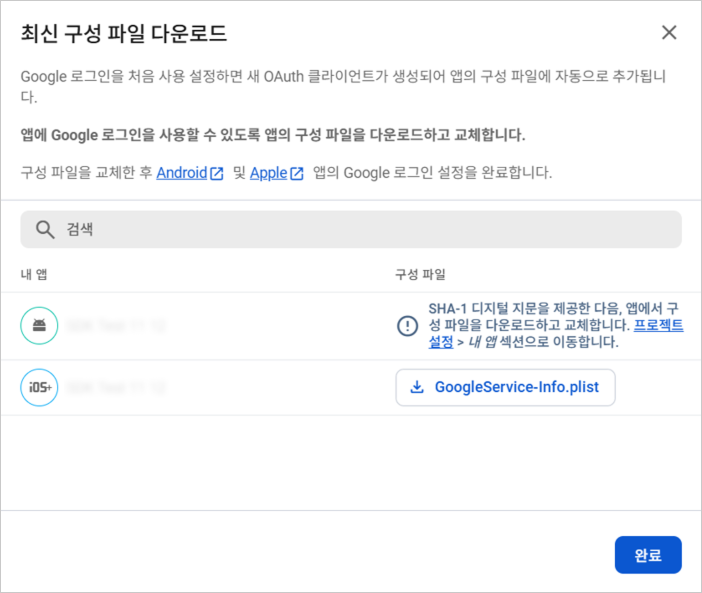

# 구글 (`google`)

> 🔔 **최신화 일자:** 2025-05-30

## **개요**

`google` 네임스페이스는 **구글 네이티브 로그인 기능을 제공**하며, 사용자는 **Google 계정을 통해 인증**할 수 있습니다.

이 네임스페이스를 사용하여 **로그인, 사용자 정보 조회, 로그인 상태 확인, 로그아웃**과 같은 기능을 수행할 수 있습니다.

---

### **필수 선행 작업**

nachocode SDK로 **구글 네이티브 기능**을 사용하기 위해서는 아래 사항이 먼저 완료되어야 합니다.

#### 1. [nachocode 대시보드](https://nachocode.io)의 [ **앱 설정** > **개발자 설정** > **안드로이드 네이티브 설정** ]에서 [SHA-1 디지털 지문](https://developers.google.com/android/guides/client-auth?hl=ko) 확인


<br/>

#### 2. [Firebase 대시보드](https://console.firebase.google.com/)의 [ 프로젝트 > Authentication > 로그인 방법 ]에서 추가 제공 업체로 [ Google ] 선택


<br/>

#### 3. 최신 구성 파일 (`google-services.json`, `GoogleService-Info.plist`) 다운로드



<br/>

#### 4. [nachocode 대시보드](https://nachocode.io)의 [ 앱 기능 > 푸시 알림 > 앱 푸시 설정 ]에 업로드


- 이미 푸시 설정이 되어있더라도 최신 구성 파일을 업로드해야 합니다.

<br/>

#### 5. [nachocode 대시보드](https://nachocode.io)의 [ 앱 설정 > 개발자 설정 > 구글 네이티브 설정 ]에서 [ 구글 로그인 ] 토글을 활성화하여 앱 설정 완료


<br/>

#### 6. [nachocode 대시보드](https://nachocode.io)의 [ 앱 빌드 > 안드로이드, iOS 앱 빌드 ]에서 [ 새 버전 만들기 ] 버튼을 클릭하여 빌드


- 구글 관련 네이티브 기능은 새로 빌드 된 버전의 앱부터 적용됩니다.

---

## **메서드 목록**

| 메서드                                                                                                         | 설명                   | 추가된 버전 |
| -------------------------------------------------------------------------------------------------------------- | ---------------------- | ----------- |
| [`login(callback)`](#logincallback-result-googleresult-idtoken-string-userdata-googleuserdata--void-void)      | 구글 네이티브 로그인   | ver.1.5.0   |
| [`isLoggedIn(callback)`](#isloggedincallback-result-googleresult-isloggedin-boolean-idtoken-string--void-void) | 로그인 상태 확인       | ver.1.5.0   |
| [`getUserData(callback)`](#getuserdatacallback-result-googleresult-userdata-googleuserdata--void-void)         | 사용자 데이터 요청     | ver.1.5.0   |
| [`logout(callback)`](#logoutcallback-result-googleresult--void-void)                                           | 구글 네이티브 로그아웃 | ver.1.5.0   |

---

## **타입 정의**

### **`GoogleResult`**

구글 로그인 및 요청의 결과 상태를 나타내는 타입입니다.

| 필드         | 타입                   | 설명                       |
| ------------ | ---------------------- | -------------------------- |
| `status`     | `'error' \| 'success'` | 요청 성공 또는 실패 상태   |
| `statusCode` | `number`               | 상태 코드 (성공 시 200)    |
| `message`    | `string` _(optional)_  | 오류 메시지 (실패 시 반환) |

---

### **`GoogleUserData`**

구글 사용자 데이터를 나타내는 타입입니다.

| 필드              | 타입      | 설명                         |
| ----------------- | --------- | ---------------------------- |
| `uid`             | `string`  | 사용자 고유 식별자           |
| `email`           | `string`  | 이메일 주소 _(optional)_     |
| `displayName`     | `string`  | 사용자 이름 _(optional)_     |
| `photoURL`        | `string`  | 프로필 사진 URL _(optional)_ |
| `phoneNumber`     | `string`  | 전화번호 _(optional)_        |
| `isEmailVerified` | `boolean` | 이메일 인증 여부             |
| `providerId`      | `string`  | 인증 제공자 ID _(optional)_  |

---

## **메서드 상세**

### **`login(callback: (result: GoogleResult, idToken?: string, userData?: GoogleUserData) => void): void`**

- _since ver.1.5.0_

#### 설명 (`login`)

구글 네이티브 로그인 요청을 수행합니다.  
로그인 성공 시 **`idToken`** 과 **`userData`** 를 콜백으로 반환합니다.

#### 매개변수 (`login`)

| 이름       | 타입                                                                          | 필수 여부 | 설명                        |
| ---------- | ----------------------------------------------------------------------------- | --------- | --------------------------- |
| `callback` | `(result: GoogleResult, idToken?: string, userData?: GoogleUserData) => void` | ✅        | 로그인 결과를 반환하는 함수 |

#### 반환 값 (`login`)

해당 메서드는 반환 값을 가지지 않으며, 결과는 `callback`을 통해 비동기적으로 제공됩니다.

#### 사용 예제 (`login`)

```javascript
Nachocode.google.login((result, idToken, userData) => {
  if (result.status === 'success') {
    console.log('구글 로그인 성공', idToken, userData);
  } else {
    console.error('구글 로그인 실패', result.message);
  }
});
```

---

### **`isLoggedIn(callback: (result: GoogleResult, isLoggedIn: boolean, idToken?: string) => void): void`**

- _since ver.1.5.0_

#### 설명 (`isLoggedIn`)

현재 사용자가 **구글 네이티브 로그인 상태인지 확인**합니다.  
로그인 여부(`isLoggedIn`)와 함께 `idToken`을 반환합니다.

#### 매개변수 (`isLoggedIn`)

| 이름       | 타입                                                                    | 필수 여부 | 설명                        |
| ---------- | ----------------------------------------------------------------------- | --------- | --------------------------- |
| `callback` | `(result: GoogleResult, isLoggedIn: boolean, idToken?: string) => void` | ✅        | 로그인 상태를 반환하는 함수 |

#### 반환 값 (`isLoggedIn`)

해당 메서드는 반환 값을 가지지 않으며, 결과는 `callback`을 통해 비동기적으로 제공됩니다.

#### 사용 예제 (`isLoggedIn`)

```javascript
Nachocode.google.isLoggedIn((result, isLoggedIn, idToken) => {
  if (isLoggedIn) {
    console.log('구글 로그인 상태입니다.', idToken);
  } else {
    console.log('구글에 로그인되어 있지 않습니다.');
  }
});
```

---

### **`getUserData(callback: (result: GoogleResult, userData?: GoogleUserData) => void): void`**

- _since ver.1.5.0_

#### 설명 (`getUserData`)

구글에서 **사용자 데이터를 요청**합니다.  
로그인된 사용자의 프로필 정보를 가져올 수 있습니다.

#### 매개변수 (`getUserData`)

| 이름       | 타입                                                        | 필수 여부 | 설명                          |
| ---------- | ----------------------------------------------------------- | --------- | ----------------------------- |
| `callback` | `(result: GoogleResult, userData?: GoogleUserData) => void` | ✅        | 사용자 데이터를 반환하는 함수 |

#### 반환 값 (`getUserData`)

해당 메서드는 반환 값을 가지지 않으며, 결과는 `callback`을 통해 비동기적으로 제공됩니다.

#### 사용 예제 (`getUserData`)

```javascript
Nachocode.google.getUserData((result, userData) => {
  if (result.status === 'success') {
    console.log('사용자 데이터:', userData);
  } else {
    console.error('사용자 데이터 요청 실패:', result.message);
  }
});
```

---

### **`logout(callback: (result: GoogleResult) => void): void`**

- _since ver.1.5.0_

#### 설명 (`logout`)

구글 네이티브 로그인 세션을 **로그아웃**합니다.

#### 매개변수 (`logout`)

| 이름       | 타입                             | 필수 여부 | 설명               |
| ---------- | -------------------------------- | --------- | ------------------ |
| `callback` | `(result: GoogleResult) => void` | ✅        | 로그아웃 결과 콜백 |

#### 반환 값 (`logout`)

해당 메서드는 반환 값을 가지지 않으며, 결과는 `callback`을 통해 비동기적으로 제공됩니다.

#### 사용 예제 (`logout`)

```javascript
Nachocode.google.logout(result => {
  if (result.status === 'success') {
    console.log('구글 로그아웃 완료');
  } else {
    console.error('구글 로그아웃 실패:', result.message);
  }
});
```

---

## **추가 정보**

- Google 로그인은 **Firebase 인증 기반**으로 동작하며, `idToken`은 서버 인증에 활용할 수 있습니다.
- 로그아웃 후에는 `isLoggedIn()` 호출 시 `false`가 반환됩니다.
