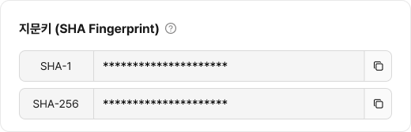
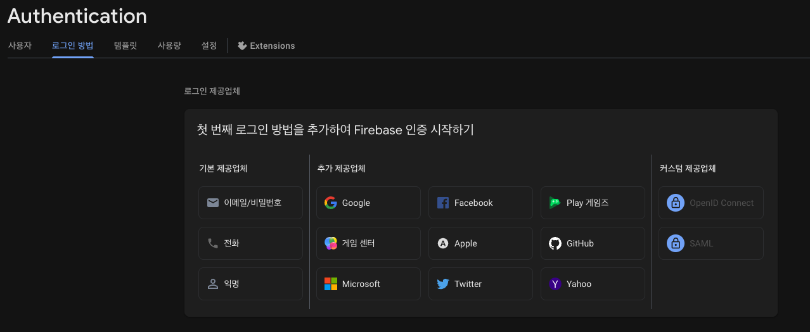
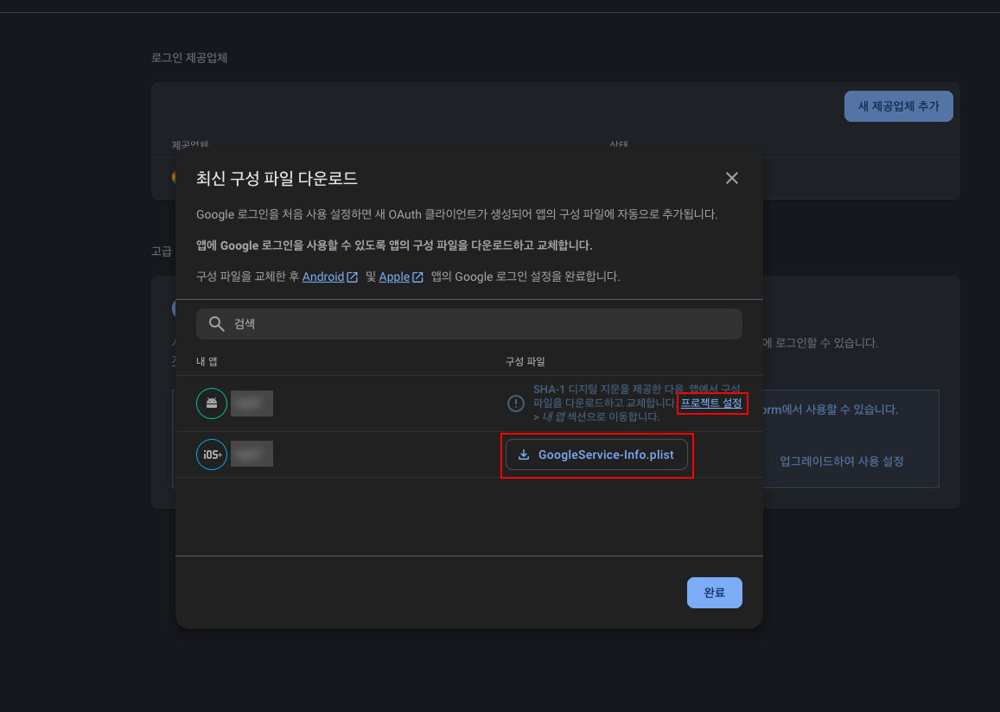
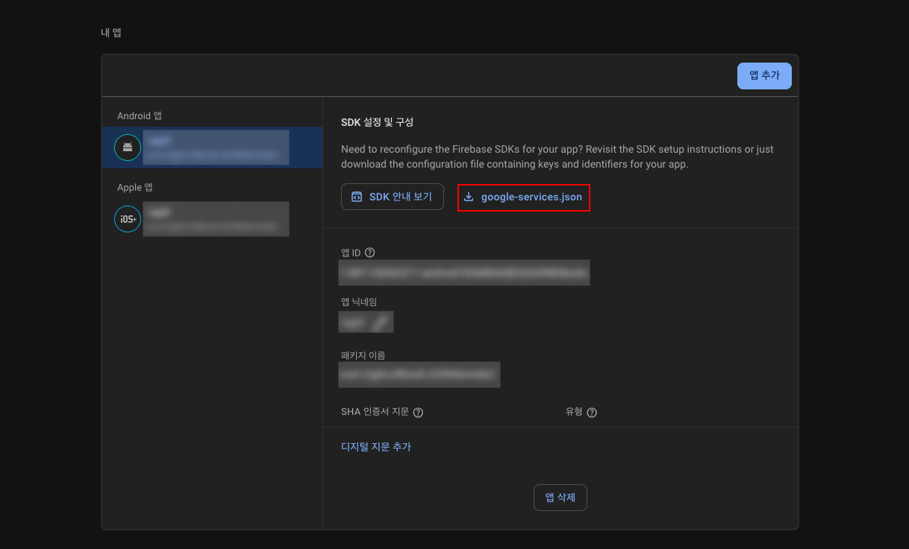
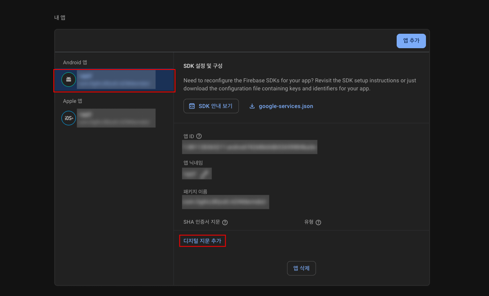
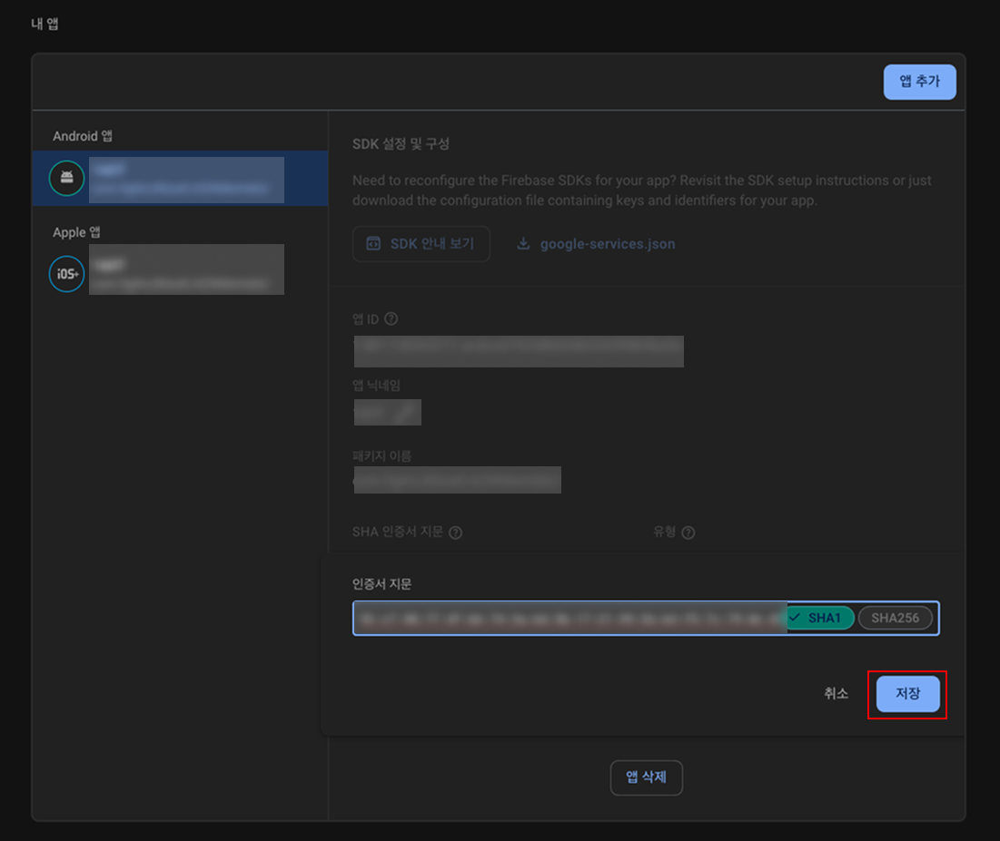
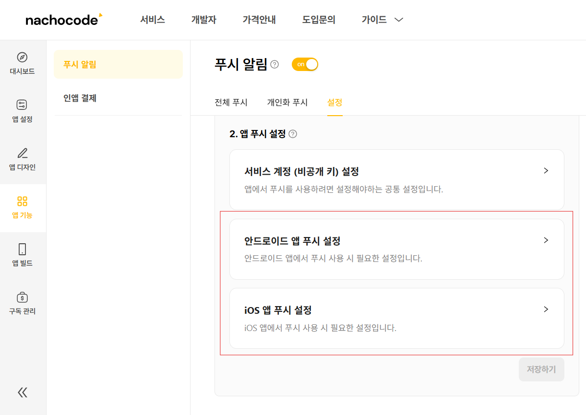
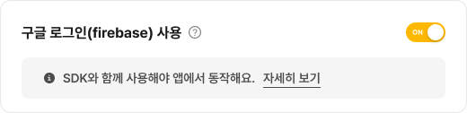
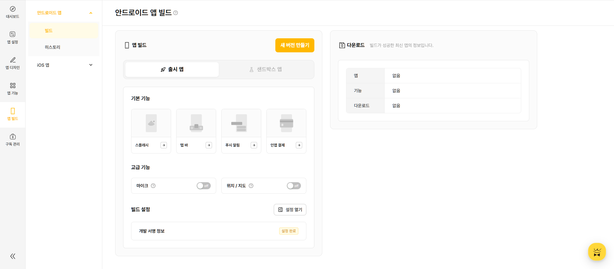
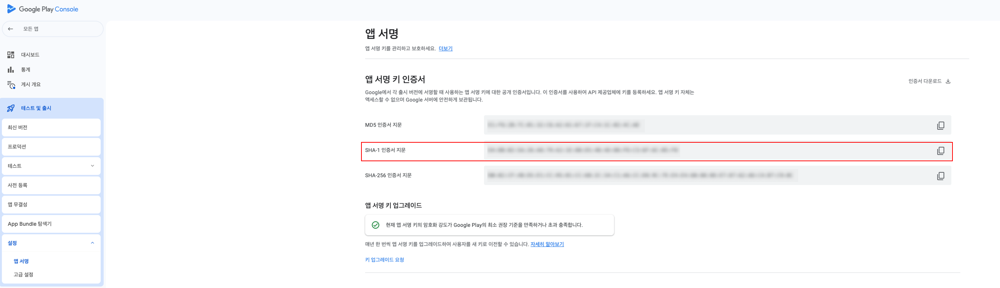

# 구글 (`google`)

import { BadgeWithVersion } from '@site/src/components/svg/badge-with-version';

> 🚀 **추가된 버전 :** <BadgeWithVersion type="SDK" version="v1.5.0" link="/docs/releases/v1/sdk/release-v-1-5-0" /> <BadgeWithVersion type="Android" version="v1.5.0" link="/docs/releases/v1/app-source/android/release-v-1-5-0" /> <BadgeWithVersion type="iOS" version="v1.5.0" link="/docs/releases/v1/app-source/ios/release-v-1-5-0" />  
> 🔔 **최신화 일자:** 2025-07-16

## **개요** {#overview}

`google` 네임스페이스는 **구글 네이티브 로그인 기능을 제공**하며, 사용자는 **Google 계정을 통해 인증**할 수 있습니다.

이 네임스페이스를 사용하여 **로그인, 사용자 정보 조회, 로그인 상태 확인, 로그아웃**과 같은 기능을 수행할 수 있습니다.

---

### **필수 선행 작업** {#prerequisite}

nachocode SDK로 **구글 네이티브 기능**을 사용하기 위해서는 아래 사항이 먼저 완료되어야 합니다.

#### 1. [nachocode 대시보드](https://nachocode.io/?utm_source=docs&utm_medium=documentation&utm_campaign=devguide)의 [ **앱 설정** > **개발자 설정** > **안드로이드 네이티브 설정** ]에서 [SHA-1 디지털 지문](https://developers.google.com/android/guides/client-auth?hl=ko) 확인 {#prerequisite-step-1}


:::info
지문키를 확인하기 위해서는 안드로이드 빌드가 선행되어야 합니다.
:::
<br/>

#### 2. [Firebase 대시보드](https://console.firebase.google.com/)의 [ 프로젝트 > Authentication > 로그인 방법 ]에서 추가 제공 업체로 [ Google ] 선택 후 사용설정 {#prerequisite-step-2}



<br/>

#### 3. `GoogleService-Info.plist` 를 다운받은 후에 [ 프로젝트 설정 ] 클릭 {#prerequisite-step-3}



<br/>

#### 4. `google-services.json` 파일 다운로드 {#prerequisite-step-4}



<br/>

#### 5. [ Android 앱 ] 탭에서 [ 디지털 지문 추가 ] 클릭 {#prerequisite-step-5}



<br/>

#### 6. [나쵸코드 대시보드](#prerequisite-step-1)에서 복사한 [ SHA-1 디지털 지문 ]을 입력 후 저장 {#prerequisite-step-6}



<br/>

#### 7. [nachocode 대시보드](https://nachocode.io/?utm_source=docs&utm_medium=documentation&utm_campaign=devguide)의 [ 앱 기능 > 푸시 알림 > 앱 푸시 설정 ]에 다운받은 파일(`GoogleService-Info.plist`, `google-services.json`)을 업로드 {#prerequisite-step-7}


:::warning
이미 푸시 설정이 되어있더라도 최신 구성 파일을 업로드해야 합니다.
:::

<br/>

#### 8. [nachocode 대시보드](https://nachocode.io/?utm_source=docs&utm_medium=documentation&utm_campaign=devguide)의 [ 앱 설정 > 개발자 설정 > 구글 네이티브 설정 ]에서 [ 구글 로그인 ] 토글을 활성화하여 앱 설정 완료 {#prerequisite-step-8}



<br/>

#### 9. [nachocode 대시보드](https://nachocode.io/?utm_source=docs&utm_medium=documentation&utm_campaign=devguide)의 [ 앱 빌드 > 안드로이드 앱 빌드 ]에서 [ 새 버전 만들기 ] 버튼을 클릭하여 빌드 {#prerequisite-step-9}



:::warning
구글 관련 네이티브 기능은 새로 빌드 된 버전의 앱부터 적용됩니다.
:::

<br/>

#### 10. 빌드된 aab 파일을 [Google Play Console](https://play.google.com/console)에 업로드 후 [ 테스트 및 출시 > 설정 > 앱 서명 ]에서 앱 서명키 인증서의 [ SHA-1 인증서 지문 ]을 확인 {#prerequisite-step-10}


:::warning
운영환경에서 구글 로그인을 사용하기 위한 필수 작업이므로 안드로이드 앱 출시 전 확인해주세요.
:::

<br/>

#### 11. [ Google Play Console ]에서 복사한 [ SHA-1 디지털 지문 ]을 입력 후 저장 {#prerequisite-step-11}


<br/>

---

## **타입 정의** {#types}

### **`GoogleResult`** {#google-result}

구글 로그인 및 요청의 결과 상태를 나타내는 타입입니다.

```typescript
export declare type GoogleSuccessResult = {
  status: 'success';
  statusCode: 200;
};
```

```typescript
export declare type GoogleErrorResult = {
  status: 'error';
  statusCode: number;
  message: string;
};
```

```typescript
export declare type GoogleResult = GoogleSuccessResult | GoogleErrorResult;
```

| 필드         | 타입                   | 설명                       |
| ------------ | ---------------------- | -------------------------- |
| `status`     | `'error' \| 'success'` | 요청 성공 또는 실패 상태   |
| `statusCode` | `number`               | 상태 코드 (성공 시 200)    |
| `message`    | `string` _(optional)_  | 오류 메시지 (실패 시 반환) |

---

### **`GoogleUserData`** {#google-user-data}

구글 사용자 데이터를 나타내는 타입입니다.

```typescript
export declare type GoogleUserData = {
  uid: string;
  email?: string;
  displayName?: string;
  photoURL?: string;
  phoneNumber?: string;
  isEmailVerified: boolean;
  providerId?: string;
};
```

| 필드              | 타입      | 설명                         |
| ----------------- | --------- | ---------------------------- |
| `uid`             | `string`  | 사용자 고유 식별자           |
| `email`           | `string`  | 이메일 주소 _(optional)_     |
| `displayName`     | `string`  | 사용자 이름 _(optional)_     |
| `photoURL`        | `string`  | 프로필 사진 URL _(optional)_ |
| `phoneNumber`     | `string`  | 전화번호 _(optional)_        |
| `isEmailVerified` | `boolean` | 이메일 인증 여부             |
| `providerId`      | `string`  | 인증 제공자 ID _(optional)_  |

---

## **메서드 목록** {#method-list}

| 메서드                                    | 설명                   | 추가된 버전                                                                                   |
| ----------------------------------------- | ---------------------- | --------------------------------------------------------------------------------------------- |
| [`login(callback)`](#login)               | 구글 네이티브 로그인   | <BadgeWithVersion type="SDK" version="v1.5.0" link="/docs/releases/v1/sdk/release-v-1-5-0" /> |
| [`isLoggedIn(callback)`](#is-logged-in)   | 로그인 상태 확인       | <BadgeWithVersion type="SDK" version="v1.5.0" link="/docs/releases/v1/sdk/release-v-1-5-0" /> |
| [`getUserData(callback)`](#get-user-data) | 사용자 데이터 요청     | <BadgeWithVersion type="SDK" version="v1.5.0" link="/docs/releases/v1/sdk/release-v-1-5-0" /> |
| [`logout(callback)`](#logout)             | 구글 네이티브 로그아웃 | <BadgeWithVersion type="SDK" version="v1.5.0" link="/docs/releases/v1/sdk/release-v-1-5-0" /> |

---

## **메서드 상세** {#method-details}

### **`login(callback: (result: GoogleResult, idToken?: string, userData?: GoogleUserData) => void): void`** {#login}

- _since :_ <BadgeWithVersion type="SDK" version="v1.5.0" link="/docs/releases/v1/sdk/release-v-1-5-0" />

:::warning 주의
_[필수 선행 작업](#prerequisite)이 완료되어야 사용할 수 있습니다._
:::

#### 설명 {#login-summary}

구글 네이티브 로그인 요청을 수행합니다.  
로그인 성공 시 **`idToken`** 과 **`userData`** 를 콜백으로 반환합니다.

#### 매개변수 {#login-parameters}

| 이름       | 타입                                                                          | 필수 여부 | 설명                        |
| ---------- | ----------------------------------------------------------------------------- | --------- | --------------------------- |
| `callback` | `(result: GoogleResult, idToken?: string, userData?: GoogleUserData) => void` | ✅        | 로그인 결과를 반환하는 함수 |

#### 반환 값 {#login-returns}

해당 메서드는 반환 값을 가지지 않으며, 결과는 `callback`을 통해 비동기적으로 제공됩니다.

#### 사용 예제 {#login-examples}

```javascript
Nachocode.google.login((result, idToken, userData) => {
  if (result.status === 'success') {
    console.log('구글 로그인 성공', idToken, userData);
  } else {
    console.error('구글 로그인 실패', result.message);
  }
});
```

---

### **`isLoggedIn(callback: (result: GoogleResult, isLoggedIn: boolean, idToken?: string) => void): void`** {#is-logged-in}

- _since :_ <BadgeWithVersion type="SDK" version="v1.5.0" link="/docs/releases/v1/sdk/release-v-1-5-0" />

:::warning 주의
_[필수 선행 작업](#prerequisite)이 완료되어야 사용할 수 있습니다._
:::

#### 설명 {#is-logged-in-summary}

현재 사용자가 **구글 네이티브 로그인 상태인지 확인**합니다.  
로그인 여부(`isLoggedIn`)와 함께 `idToken`을 반환합니다.

로그인이 되어있을 경우 `isLoggedIn`에는 `true` 값이, `idToken`에는 문자열이 담겨 콜백을 호출합니다.  
비로그인 상태거나 에러가 발생할 경우 `isLoggedIn`에는 `false` 값이, `idToken`은 `undefined`로 콜백을 호출합니다.

#### 매개변수 {#is-logged-in-parameters}

| 이름       | 타입                                                                    | 필수 여부 | 설명                        |
| ---------- | ----------------------------------------------------------------------- | --------- | --------------------------- |
| `callback` | `(result: GoogleResult, isLoggedIn: boolean, idToken?: string) => void` | ✅        | 로그인 상태를 반환하는 함수 |

#### 반환 값 {#is-logged-in-returns}

해당 메서드는 반환 값을 가지지 않으며, 결과는 `callback`을 통해 비동기적으로 제공됩니다.

#### 사용 예제 {#is-logged-in-examples}

```javascript
Nachocode.google.isLoggedIn((result, isLoggedIn, idToken) => {
  if (result.status === 'success') {
    if (isLoggedIn) {
      // 네이티브 구글 로그인된 상태
      console.log('구글 로그인 상태입니다.', idToken);
    } else {
      // 네이티브 구글 로그아웃 상태
      console.log('구글 로그인이 되어 있지 않습니다.');
    }
  } else {
    // 네이티브 정보 불러오기 실패
    console.error('구글 로그인 정보 불러오기 실패');
  }
});
```

---

### **`getUserData(callback: (result: GoogleResult, userData?: GoogleUserData) => void): void`** {#get-user-data}

- _since :_ <BadgeWithVersion type="SDK" version="v1.5.0" link="/docs/releases/v1/sdk/release-v-1-5-0" />

:::warning 주의
_[필수 선행 작업](#prerequisite)이 완료되어야 사용할 수 있습니다._
:::

#### 설명 {#get-user-data-summary}

구글에서 **사용자 데이터를 요청**합니다.  
로그인된 사용자의 프로필 정보를 가져올 수 있습니다.

#### 매개변수 {#get-user-data-parameters}

| 이름       | 타입                                                        | 필수 여부 | 설명                          |
| ---------- | ----------------------------------------------------------- | --------- | ----------------------------- |
| `callback` | `(result: GoogleResult, userData?: GoogleUserData) => void` | ✅        | 사용자 데이터를 반환하는 함수 |

#### 반환 값 {#get-user-data-returns}

해당 메서드는 반환 값을 가지지 않으며, 결과는 `callback`을 통해 비동기적으로 제공됩니다.

#### 사용 예제 {#get-user-data-examples}

```javascript
Nachocode.google.getUserData((result, userData) => {
  if (result.status === 'success') {
    console.log('사용자 데이터:', userData);
  } else {
    console.error('사용자 데이터 요청 실패:', result.message);
  }
});
```

---

### **`logout(callback: (result: GoogleResult) => void): void`** {#logout}

- _since :_ <BadgeWithVersion type="SDK" version="v1.5.0" link="/docs/releases/v1/sdk/release-v-1-5-0" />

:::warning 주의
_[필수 선행 작업](#prerequisite)이 완료되어야 사용할 수 있습니다._
:::

#### 설명 {#logout-summary}

구글 네이티브 로그인 세션을 **로그아웃**합니다.

#### 매개변수 {#logout-parameters}

| 이름       | 타입                             | 필수 여부 | 설명               |
| ---------- | -------------------------------- | --------- | ------------------ |
| `callback` | `(result: GoogleResult) => void` | ✅        | 로그아웃 결과 콜백 |

#### 반환 값 {#logout-returns}

해당 메서드는 반환 값을 가지지 않으며, 결과는 `callback`을 통해 비동기적으로 제공됩니다.

#### 사용 예제 {#logout-examples}

```javascript
Nachocode.google.logout(result => {
  if (result.status === 'success') {
    console.log('구글 로그아웃 완료');
  } else {
    console.error('구글 로그아웃 실패:', result.message);
  }
});
```

---

:::info **추가 정보**

- Google 로그인은 **Firebase 인증 기반**으로 동작하며, `idToken`은 서버 인증에 활용할 수 있습니다.
- 로그아웃 후에는 `isLoggedIn()` 호출 시 `false`가 반환됩니다.

:::
