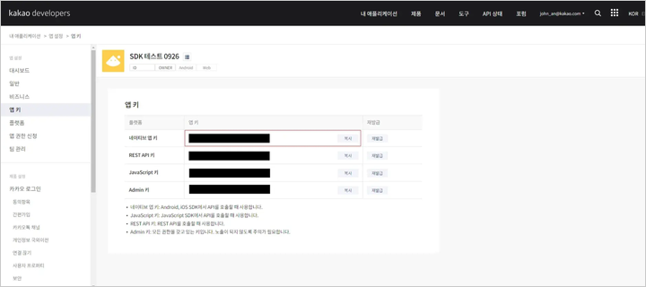
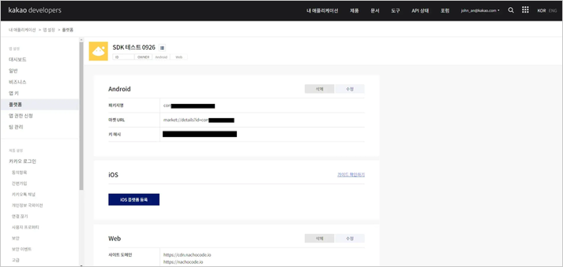
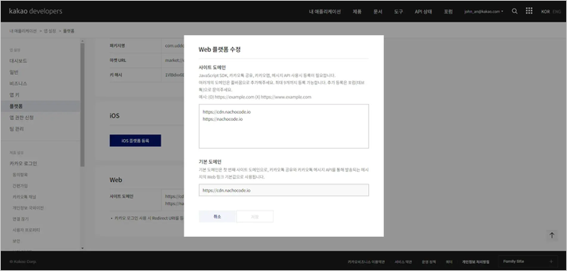
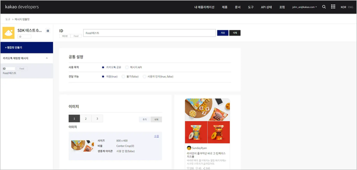
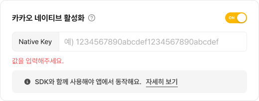

# 카카오 (`kakao`)

> 🔔 **최신화 일자:** 2025-05-30

## **개요**

`kakao` 네임스페이스는 **카카오 네이티브 로그인** 및 **카카오톡 공유 기능**을 제공합니다.  
이 네임스페이스를 통해 **로그인, 사용자 정보 조회, 로그아웃, 연결 해제(unlink)** 를 수행하거나,  
**커스텀 템플릿 / URL 스크랩 기반** 카카오톡 공유 기능을 구현할 수 있습니다.

---

### **필수 선행 작업**

nachocode SDK로 **카카오 네이티브 기능**을 사용하기 위해서는 아래 사항이 먼저 완료되어야 합니다.

#### 1. [nachocode 대시보드](https://nachocode.io)의 [ **앱 설정** > **개발자 설정** > **안드로이드 네이티브 설정** ]에서 [해시키](https://developers.google.com/android/guides/client-auth?hl=ko) 확인


<br/>

#### 2. [Kakao Developers](https://developers.kakao.com/console/app)에서 애플리케이션 생성 및 네이티브 앱 키 발급

- 여기서 확인한 **네이티브 앱 키**는 [5. 대시보드 설정](#nachocode-dashboard-configuration) 시 필요합니다.

 <br/>



#### 3. 플랫폼 등록 ([Android](https://developers.kakao.com/docs/latest/ko/getting-started/app#platform-android), [iOS](https://developers.kakao.com/docs/latest/ko/getting-started/app#platform-ios))

- **Android 및 iOS 플랫폼을 등록**합니다.
- **패키지명 및 번들 ID**는 **나쵸코드 대시보드에 등록된 것**과 반드시 일치해야 합니다.
- [대시보드에서 확인한 키 해시](#1-nachocode-대시보드의--앱-설정--개발자-설정--안드로이드-네이티브-설정-에서-해시키-확인)를 Android 플랫폼에 등록합니다.



<br/>

#### 4-1. (선택사항) 공유하기 사용 시, 사이트 도메인 등록

- **스크랩 공유하기 기능**을 이용하기 위해서는 **사이트 도메인을 미리 등록**해야 합니다.
- 운영 서버, 개발 서버 등의 도메인을 미리 등록해야 **스크랩 공유하기** 기능을 원활히 테스트 및 구현 가능합니다.



<br/>

#### 4-2. (선택사항) 공유하기 사용 시, [메시지 템플릿](https://developers.kakao.com/docs/latest/ko/message-template/common) 등록 [ 도구 > 메시지 템플릿 ]

- **커스텀 템플릿 공유하기 기능**을 이용하기 위해서는 카카오톡의 **메시지 템플릿 빌더**를 활용해 미리 **메시지 템플릿**을 만들어 저장해둬야 합니다.
- 이 때 발급 받은 **템플릿 ID**를 활용하여 **nachocode SDK**를 통해 **템플릿 메시지 전송**이 가능해집니다.



<br/>

#### 5. [nachocode 대시보드](https://nachocode.io)의 [ 앱 설정 > 개발자 설정 > 카카오 네이티브 설정 ]에서 [ 카카오 네이티브 활성화 ] 토글 활성화 후 Kakao Developers에서 발급한 **네이티브 앱 키**를 등록하여 앱 설정 완료 {#nachocode-dashboard-configuration}



<br/>

#### 6. [nachocode 대시보드](https://nachocode.io)의 [ 앱 빌드 > 안드로이드, iOS 앱 빌드 ]에서 [ 새 버전 만들기 ] 버튼을 클릭하여 빌드


- 카카오 관련 네이티브 기능은 새로 빌드 된 버전의 앱부터 적용됩니다.

---

## **타입 정의**

### **`KakaoResult`**

- _since ver.1.5.0_

카카오 API 요청 결과를 나타내는 타입입니다.

| 필드         | 타입                   | 설명                         |
| ------------ | ---------------------- | ---------------------------- |
| `status`     | `'error' \| 'success'` | 요청 성공 또는 실패 상태     |
| `statusCode` | `number`               | 요청 결과 코드 (성공 시 200) |
| `message`    | `string` _(optional)_  | 오류 메시지 (실패 시 반환)   |

---

### **`KakaoLoginData`**

- _since ver.1.5.0_

카카오 로그인 결과 데이터입니다.

| 필드                    | 타입     | 설명                              |
| ----------------------- | -------- | --------------------------------- |
| `accessToken`           | `string` | 액세스 토큰 _(optional)_          |
| `accessTokenExpiresAt`  | `Date`   | 액세스 토큰 만료일 _(optional)_   |
| `refreshToken`          | `string` | 리프레시 토큰 _(optional)_        |
| `refreshTokenExpiresAt` | `Date`   | 리프레시 토큰 만료일 _(optional)_ |
| `idToken`               | `string` | ID 토큰 _(optional)_              |

---

### **`KakaoUserData`**

- _since ver.1.5.0_

카카오 사용자 정보 데이터입니다.

| 필드      | 타입      | 설명                          |
| --------- | --------- | ----------------------------- |
| `id`      | `number`  | 카카오 사용자 고유 ID         |
| `email`   | `string`  | 대표 이메일 _(optional)_      |
| `name`    | `string`  | 이름 _(optional)_             |
| `profile` | `string`  | 프로필 정보 _(optional)_      |
| 기타 필드 | `unknown` | 추가 사용자 속성 _(optional)_ |

<!-- markdownlint-disable MD033 -->
<details>
  <summary>전체 보기</summary>

| 필드                            | 타입      | 설명                                           |
| ------------------------------- | --------- | ---------------------------------------------- |
| `id`                            | `number`  | 카카오 사용자 고유 ID                          |
| `connectedAt`                   | `Date`    | 연결 시각 _(optional)_                         |
| `profileNeedsAgreement`         | `boolean` | 프로필 제공 동의 필요 여부 _(optional)_        |
| `profileNicknameNeedsAgreement` | `boolean` | 닉네임 제공 동의 필요 여부 _(optional)_        |
| `profileImageNeedsAgreement`    | `boolean` | 프로필 이미지 제공 동의 필요 여부 _(optional)_ |
| `profile`                       | `string`  | 프로필 정보 _(optional)_                       |
| `nameNeedsAgreement`            | `boolean` | 이름 제공 동의 필요 여부 _(optional)_          |
| `name`                          | `string`  | 이름 _(optional)_                              |
| `emailNeedsAgreement`           | `boolean` | 이메일 제공 동의 필요 여부 _(optional)_        |
| `isEmailValid`                  | `boolean` | 이메일 유효성 여부 _(optional)_                |
| `isEmailVerified`               | `boolean` | 이메일 인증 여부 _(optional)_                  |
| `email`                         | `string`  | 대표 이메일 _(optional)_                       |
| `ageRangeNeedsAgreement`        | `boolean` | 연령대 제공 동의 필요 여부 _(optional)_        |
| `ageRange`                      | `unknown` | 연령대 _(optional)_                            |
| `birthyearNeedsAgreement`       | `boolean` | 출생 연도 제공 동의 필요 여부 _(optional)_     |
| `birthyear`                     | `string`  | 출생 연도 (`YYYY`) _(optional)_                |
| `birthdayNeedsAgreement`        | `boolean` | 생일 제공 동의 필요 여부 _(optional)_          |
| `birthday`                      | `string`  | 생일 (`MMDD`) _(optional)_                     |
| `birthdayType`                  | `unknown` | 생일 타입 _(optional)_                         |
| `genderNeedsAgreement`          | `boolean` | 성별 제공 동의 필요 여부 _(optional)_          |
| `gender`                        | `string`  | 성별 _(optional)_                              |
| `legalName`                     | `string`  | 법적 이름 _(optional)_                         |
| `legalGenderNeedsAgreement`     | `boolean` | 법적 성별 제공 동의 필요 여부 _(optional)_     |
| `legalGender`                   | `string`  | 법적 성별 _(optional)_                         |
| `legalBirthDateNeedsAgreement`  | `boolean` | 법적 생년월일 제공 동의 필요 여부 _(optional)_ |
| `legalBirthDate`                | `string`  | 법적 생년월일 (`yyyyMMdd`) _(optional)_        |
| `phoneNumberNeedsAgreement`     | `boolean` | 전화번호 제공 동의 필요 여부 _(optional)_      |
| `phoneNumber`                   | `string`  | 전화번호 _(optional)_                          |
| `isKoreanNeedsAgreement`        | `boolean` | 한국인 여부 제공 동의 필요 여부 _(optional)_   |
| `isKorean`                      | `boolean` | 한국인 여부 _(optional)_                       |

</details>
<!-- markdownlint-enable MD033 -->

---

### **`KakaoShareType`**

- _since ver.1.2.0_
- _lastupdated ver.1.5.0_

카카오톡 공유 유형을 나타내는 타입(type)입입니다.

```typescript
type KakaoShareType = 'custom' | 'scrap';
```

| 값       | 설명                                               |
| -------- | -------------------------------------------------- |
| `custom` | 미리 등록된 커스텀 템플릿을 사용하여 카카오톡 공유 |
| `scrap`  | URL을 기반으로 카카오톡 스크랩 공유                |

---

### **`KakaoShareCustom`**

- _since ver.1.2.0_
- _lastupdated ver.1.5.0_

카카오톡 커스텀 템플릿 공유 시 사용할 데이터 타입입니다.

```typescript
declare type KakaoShareCustom = {
  templateId: number;
  templateArgs?: {
    [key: string]: string;
  };
  serverCallbackArgs?: {
    [key: string]: string;
  };
};
```

| 필드                 | 타입                                     | 설명                                            |
| -------------------- | ---------------------------------------- | ----------------------------------------------- |
| `templateId`         | `number`                                 | 카카오 개발자 센터에서 등록한 템플릿 ID         |
| `templateArgs`       | `{ [key: string]: string }` _(optional)_ | 템플릿에 전달할 가변적인 값                     |
| `serverCallbackArgs` | `{ [key: string]: string }` _(optional)_ | 공유 결과를 서버에서 처리할 경우 함께 전달할 값 |

---

### **`KakaoShareScrap`**

- _since ver.1.2.0_
- _lastupdated ver.1.5.0_

카카오톡 URL 스크랩 공유 시 사용할 데이터 타입입니다.

```typescript
declare type KakaoShareScrap = {
  requestUrl: string;
  templateId?: number;
  templateArgs?: {
    [key: string]: string;
  };
  serverCallbackArgs?: {
    [key: string]: string;
  };
};
```

| 필드                 | 타입                                     | 설명                                            |
| -------------------- | ---------------------------------------- | ----------------------------------------------- |
| `requestUrl`         | `string`                                 | 스크랩할 대상 URL                               |
| `templateId`         | `number` _(optional)_                    | 카카오 개발자 센터에서 등록한 템플릿 ID         |
| `templateArgs`       | `{ [key: string]: string }` _(optional)_ | 템플릿에 전달할 가변적인 값                     |
| `serverCallbackArgs` | `{ [key: string]: string }` _(optional)_ | 공유 결과를 서버에서 처리할 경우 함께 전달할 값 |

---

### **`KAKAO_SHARE_STATUS_CODES`**

- _since ver.1.5.0_

카카오 공유 요청의 상태 코드 목록입니다.

```typescript
const KAKAO_SHARE_STATUS_CODES = {
  ERROR_JSON_FAILED: 102,
  ERROR_JSON_FAILED_TO_MODEL: 103,
  ERROR_JSON_FAILED_TO_KAKAO_MODEL: 104,
  ERROR_JSON_WRONG_SHARE_TYPE: 105,
  ERROR_JSON_EMPTY_REQUEST_URL: 106,
  ERROR_JSON_EMPTY_TEMPLATE_ID: 108,
  ERROR_KAKAO_FAILED: 199,
  SUCCESS_KAKAO: 200,
  SUCCESS_SAFARI: 201,
} as const;
```

| 값    | 설명                                                 |
| ----- | ---------------------------------------------------- |
| `102` | JSON 변환 실패                                       |
| `103` | JSON을 모델로 변환하는 과정에서 오류 발생            |
| `104` | JSON을 카카오 모델로 변환하는 과정에서 오류 발생     |
| `105` | 잘못된 공유 타입 지정 (`custom` 또는 `scrap`이 아님) |
| `106` | `scrap` 공유 타입에서 `requestUrl`이 비어 있음       |
| `108` | `custom` 공유 타입에서 `templateId`가 비어 있음      |
| `199` | 카카오 공유 요청 실패                                |
| `200` | 성공 (카카오톡 공유 성공)                            |
| `201` | 성공 (외부 브라우저를 통한 공유 성공)                |

---

### **`KakaoShareStatusCode`**

- _since ver.1.5.0_

카카오 공유 요청의 상태 코드 타입(type)입니다.

```typescript
type KakaoShareStatusCode = 102 | 103 | 104 | 105 | 106 | 108 | 199 | 200 | 201;
```

---

## **메서드 목록**

| 메서드                                                                                                                                         | 설명                                    | 추가된 버전 |
| ---------------------------------------------------------------------------------------------------------------------------------------------- | --------------------------------------- | ----------- |
| [`login(callback)`](#logincallback-result-kakaoresult-logindata-kakaologindata--void-void)                                                     | 카카오 네이티브 로그인                  | ver.1.5.0   |
| [`isLoggedIn(callback)`](#isloggedincallback-result-kakaoresult-isloggedin-boolean-logindata-kakaologindata--void-void)                        | 로그인 상태 확인                        | ver.1.5.0   |
| [`getUserData(callback)`](#getuserdatacallback-result-kakaoresult-userdata-kakaouserdata--void-void)                                           | 사용자 데이터 요청                      | ver.1.5.0   |
| [`logout(callback)`](#logoutcallback-result-kakaoresult--void-void)                                                                            | 카카오 네이티브 로그아웃                | ver.1.5.0   |
| [`unlink(callback)`](#unlinkcallback-result-kakaoresult--void-void)                                                                            | 앱과 카카오 계정 연결 해제              | ver.1.5.0   |
| [`share(type, data, callback?)`](#sharetype-kakaosharetype-data-kakaosharecustom--kakaosharescrap-callback-result-kakaoshareresult--void-void) | 카카오톡 커스텀 템플릿/스크랩 공유 기능 | ver.1.5.0   |

---

## **메서드 상세**

### **`login(callback: (result: KakaoResult, loginData?: KakaoLoginData) => void): void`**

- _since ver.1.5.0_
- 📢 _[필수 선행 작업](#필수-선행-작업)이 완료되어야 사용할 수 있습니다._

#### 설명 (`login`)

카카오 네이티브 로그인을 수행합니다.  
성공 시 `loginData`를 콜백을 통해 반환합니다.

#### 사용 예제 (`login`)

```javascript
Nachocode.kakao.login((result, loginData) => {
  if (result.status === 'success') {
    console.log('카카오 로그인 성공', loginData);
  } else {
    console.error('카카오 로그인 실패', result.message);
  }
});
```

---

### **`isLoggedIn(callback: (result: KakaoResult, isLoggedIn: boolean, loginData?: KakaoLoginData) => void): void`**

- _since ver.1.5.0_
- 📢 _[필수 선행 작업](#필수-선행-작업)이 완료되어야 사용할 수 있습니다._

#### 설명 (`isLoggedIn`)

현재 사용자의 카카오 로그인 상태를 확인합니다.

#### 사용 예제 (`isLoggedIn`)

```javascript
Nachocode.kakao.isLoggedIn((result, isLoggedIn, loginData) => {
  if (isLoggedIn) {
    console.log('카카오 로그인 상태', loginData);
  } else {
    console.log('카카오 로그인되어 있지 않음');
  }
});
```

---

### **`getUserData(callback: (result: KakaoResult, userData?: KakaoUserData) => void): void`**

- _since ver.1.5.0_
- 📢 _[필수 선행 작업](#필수-선행-작업)이 완료되어야 사용할 수 있습니다._

#### 설명 (`getUserData`)

로그인된 사용자의 카카오 정보를 가져옵니다.

#### 사용 예제 (`getUserData`)

```javascript
Nachocode.kakao.getUserData((result, userData) => {
  if (result.status === 'success') {
    console.log('카카오 사용자 정보', userData);
  } else {
    console.error('사용자 정보 가져오기 실패', result.message);
  }
});
```

---

### **`logout(callback: (result: KakaoResult) => void): void`**

- _since ver.1.5.0_
- 📢 _[필수 선행 작업](#필수-선행-작업)이 완료되어야 사용할 수 있습니다._

#### 설명 (`logout`)

카카오 네이티브 로그인 세션을 로그아웃합니다.

다시 로그인 시도 시 자동으로 이전에 연결된 카카오 계정으로 다시 인가 과정을 수행합니다.

#### 사용 예제 (`logout`)

```javascript
Nachocode.kakao.logout(result => {
  if (result.status === 'success') {
    console.log('카카오 로그아웃 성공');
  } else {
    console.error('카카오 로그아웃 실패', result.message);
  }
});
```

---

### **`unlink(callback: (result: KakaoResult) => void): void`**

- _since ver.1.5.0_
- 📢 _[필수 선행 작업](#필수-선행-작업)이 완료되어야 사용할 수 있습니다._

#### 설명 (`unlink`)

앱과 카카오 계정 간의 연결을 해제(unlink)합니다.

다시 로그인 시도 시 카카오에서 처음부터 다시 인가 과정을 수행합니다.

#### 사용 예제 (`unlink`)

```javascript
Nachocode.kakao.unlink(result => {
  if (result.status === 'success') {
    console.log('카카오 연결 해제 성공');
  } else {
    console.error('카카오 연결 해제 실패', result.message);
  }
});
```

---

### **`share(type: KakaoShareType, data: KakaoShareCustom | KakaoShareScrap, callback?: (result: KakaoShareResult) => void): void`**

- _since ver.1.5.0_
- 📢 _[필수 선행 작업](#필수-선행-작업)이 완료되어야 사용할 수 있습니다._

#### 설명 (`share`)

카카오톡 공유 기능을 수행합니다.  
[커스텀 템플릿](https://developers.kakao.com/docs/latest/ko/message-template/common#configuration-method-type)(`custom`) 또는 URL [스크랩](https://developers.kakao.com/docs/latest/ko/message-template/common#scrap)(`scrap`) 방식을 사용하여 공유할 수 있습니다.  
공유 결과는 선택적으로 `callback` 함수를 통해 전달받을 수 있습니다.

_참고 : [kakao developers - 메시지 템플릿 이해하기](https://developers.kakao.com/docs/latest/ko/message-template/common)_

#### 매개변수 (`share`)

| 이름       | 타입                                         | 필수 여부 | 설명                                    |
| ---------- | -------------------------------------------- | --------- | --------------------------------------- |
| `type`     | `KakaoShareType`                             | ✅        | `custom` 또는 `scrap` 공유 방식 선택    |
| `data`     | `KakaoShareCustom \| KakaoShareScrap`        | ✅        | 공유할 데이터 (템플릿 ID 또는 URL 필요) |
| `callback` | `(result: KakaoResult) => void` _(optional)_ | ❌        | 공유 결과를 처리할 콜백 함수            |

#### 사용 예제 (커스텀 템플릿)

```javascript
// 커스텀 템플릿을 활용한 카카오톡 공유
Nachocode.kakao.share(
  'custom',
  {
    templateId: 12345,
    templateArgs: { name: 'Nachocode' },
  },
  result => {
    if (result.status === 'success') {
      console.log('카카오톡 공유 성공');
    } else {
      console.error('카카오톡 공유 실패', result.message);
    }
  }
);
```

#### 사용 예제 (URL 스크랩)

```javascript
// URL을 활용한 카카오톡 공유
Nachocode.kakao.share(
  'scrap',
  {
    requestUrl: 'https://nachocode.io',
  },
  result => {
    if (result.status === 'success') {
      console.log('카카오톡 공유 성공');
    } else {
      console.error('카카오톡 공유 실패', result.message);
    }
  }
);
```

---

## **추가 정보**

- 카카오 공유를 위해서는 **카카오 개발자 센터**에서 앱 키 설정이 선행되어야 합니다.
- `custom` 공유 방식의 경우, **카카오 개발자 센터에서 사전 등록된 템플릿 ID**가 필요합니다.
- `scrap` 방식은 카카오 서버가 스크랩 API를 통해 대상 URL의 메타데이터를 가져와 미리보기를 생성합니다.
- 실패할 경우, `KakaoResult`의 `status` 값이 `'error'`로 설정되며 `message` 필드에 오류 원인이 포함됩니다.
- 카카오 설정 시 어려움이 있으시면 언제든지 [support@nachocode.io](mailto:support@nachocode.io)로 문의해 주세요.
