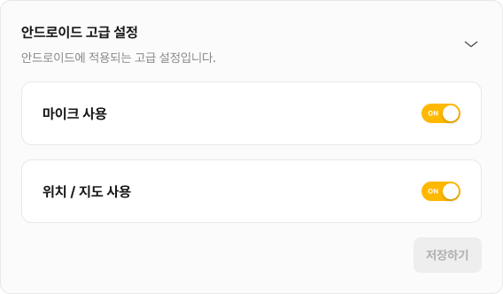

# 위치 (`location`)

> 🚀 **추가된 버전:** `ver.1.6.2`  
> 🔔 **최신화 일자:** 2025-07-11

## **개요**

`location` 네임스페이스는 디바이스의 **현재 위치 정보를 가져오는 기능**을 제공합니다.

플랫폼 환경(Android, iOS, Web)을 자동으로 감지하며, 위치 권한 요청도 자동으로 처리합니다.  
현재 위치 확인 기능은 **웹, Android, iOS 플랫폼 모두에서 사용 가능**합니다.

---

### **필수 선행 작업**



:::info
**Android 플랫폼에서 nachocode SDK의 위치 기능**을 사용하기 위해서는  
[nachocode 대시보드](https://nachocode.io/?utm_source=docs&utm_medium=documentation&utm_campaign=devguide)의 [ **앱 설정** > **고급 설정** > **안드로이드 고급 설정** ]에서 [ **위치/지도 사용** ]  
토글을 활성화하여 앱 설정을 완료하여야합니다.
:::


:::info
위치 관련 네이티브 기능은 토글을 활성화하여 앱 설정 완료 후  
[nachocode 대시보드](https://nachocode.io/?utm_source=docs&utm_medium=documentation&utm_campaign=devguide)의 [ **앱 빌드** > **안드로이드 앱 빌드** ]에서 [ **새 버전 만들기** ]  
버튼을 클릭하여 **새로 빌드 된 버전의 앱부터 적용**됩니다.
:::

---

## **타입 정의**

### **`LocationPosition`**

- _since ver.1.6.2_

```typescript
export declare type LocationPosition = {
  latitude: number;
  longitude: number;
};
```

| 필드        | 타입     | 설명                                                          |
| ----------- | -------- | ------------------------------------------------------------- |
| `latitude`  | `number` | 위치의 **위도**를 나타냅니다. 북위는 양수, 남위는 음수입니다. |
| `longitude` | `number` | 위치의 **경도**를 나타냅니다. 동경은 양수, 서경은 음수입니다. |

---

### **`GetCurrentPositionSuccessResult`**

- _since ver.1.6.2_

```typescript
export declare type GetCurrentPositionSuccessResult = {
  status: 'success';
  statusCode: 200;
  message: string;
  data: LocationPosition;
};
```

| 필드         | 타입               | 설명           |
| ------------ | ------------------ | -------------- |
| `status`     | `'success'`        | 성공 상태      |
| `statusCode` | `200`              | 성공 코드      |
| `message`    | `string`           | 응답 메시지    |
| `data`       | `LocationPosition` | 위치 정보 객체 |

---

### **`GetCurrentPositionErrorResult`**

- _since ver.1.6.2_

```typescript
export declare type GetCurrentPositionErrorResult = {
  status: 'error';
  statusCode: 400 | number;
  message: string;
  errorCode: string;
};
```

| 필드         | 타입      | 설명                |
| ------------ | --------- | ------------------- |
| `status`     | `'error'` | 에러 상태           |
| `statusCode` | `number`  | 실패 코드 (예: 400) |
| `message`    | `string`  | 에러 메시지         |
| `errorCode`  | `string`  | 에러 코드           |

---

### **`GetCurrentPositionResult`**

- _since ver.1.6.2_

```typescript
export declare type GetCurrentPositionResult =
  | GetCurrentPositionSuccessResult
  | GetCurrentPositionErrorResult;
```

---

## **메서드 목록**

| 메서드                                          | 설명                                            | 추가된 버전 |
| ----------------------------------------------- | ----------------------------------------------- | ----------- |
| [`getCurrentPosition()`](#get-current-position) | 디바이스의 현재 위치를 비동기적으로 가져옵니다. | ver.1.6.2   |

---

## **메서드 상세**

### **`getCurrentPosition(): Promise<GetCurrentPositionResult>`** {#get-current-position}

- _since ver.1.6.2_

:::warning 주의
_[필수 선행 작업](#필수-선행-작업)이 완료되어야 Android 플랫폼에서 사용할 수 있습니다._
:::

#### 설명 {#get-current-position-summary}

디바이스의 현재 위치 정보를 가져옵니다.  
필요 시 위치 권한을 자동으로 요청하며, 플랫폼에 따라 아래 방식으로 처리됩니다.

- **Android / iOS**: 네이티브 GPS 위치 정보를 가져옵니다.
- **Web**: 브라우저의 Geolocation API를 사용합니다.

:::warning **주의사항**

- Web에서 위치 정보는 HTTPS 환경에서만 동작합니다.
- 위치 권한을 거부한 사용자의 위치 정보를 가져올 수는 없습니다.
- 최초 호출 시 권한 요청이 자동 수행됩니다.

:::

:::tip 참고
[MDN - Geolocation: getCurrentPosition( ) method](https://developer.mozilla.org/en-US/docs/Web/API/Geolocation/getCurrentPosition)
:::

#### 지원 플랫폼 {#get-current-position-supported-platforms}

`getCurrentPosition` 메서드는 App과 Web 환경을 동시 지원합니다.

| 플랫폼  | 지원 여부 | 비고                 |
| ------- | --------- | -------------------- |
| Android | ✅        | 네이티브 GPS 사용    |
| iOS     | ✅        | 네이티브 GPS 사용    |
| Web     | ✅        | Geolocation API 사용 |

#### 반환 값 {#get-current-position-returns}

| 타입                                | 설명                              |
| ----------------------------------- | --------------------------------- |
| `Promise<GetCurrentPositionResult>` | 위치 정보 요청 결과를 반환합니다. |

---

## **사용 예제** {#get-current-position-examples}

### **예시 1: 기본 위치 요청** {#get-current-position-example-general}

```javascript
// Nachocode SDK를 통한 현재 위치 요청
const result = await Nachocode.location.getCurrentPosition();

if (result.status === 'success') {
  // 성공적으로 위치를 수신한 경우
  const { latitude, longitude } = result.data;
  console.log('현재 위치:', latitude, longitude);
  // 위치 정보를 활용한 로직 구현
} else {
  // 위치 요청 실패 시
  console.warn('⚠️ 위치 정보를 가져오지 못했습니다.');
  console.error('message:', result.message);
  console.error('errorCode:', result.errorCode);
}
```

---

### **예시 2: Google Map 연동** {#get-current-position-example-google}

```javascript
// Google Maps 라이브러리 로드
var { Map } = await google.maps.importLibrary('maps');
await google.maps.importLibrary('marker');

// 기본 지도 생성
var googleMap = new Map(document.getElementById('mapGoogle'), {
  center: { lat: 37.566826, lng: 126.9786567 }, // 서울 시청 좌표
  zoom: 15,
});

if (window.Nachocode) {
  // Nachocode SDK를 통한 현재 위치 요청
  const result = await Nachocode.location.getCurrentPosition();
  if (result.status === 'success') {
    // 성공적으로 위치를 수신한 경우
    const { latitude, longitude } = result.data;
    // 위치 정보를 지도에 반영
    var locPosition = new google.maps.LatLng(latitude, longitude);
    googleMap.setCenter(locPosition);
    googleMap.setZoom(15);
  } else {
    // 위치 요청 실패 시
    const errorMessage =
      `현재 위치를 불러오는데 실패하였습니다.` +
      (result.errorCode ? `\nCode: ${result.errorCode}` : '') +
      (result.message ? `\nMessage: ${result.message}` : '');
    alert(errorMessage);
  }
} else {
  console.error('Nachocode SDK 로드 실패');
}
```

---

### **예시 3: Naver Map 연동** {#get-current-position-example-naver}

```javascript
// 기본 지도 생성
var naverMapCenter = new naver.maps.LatLng(37.566826, 126.9786567); // 지도의 중심좌표 (ex 서울 시청)
var naverMap = new naver.maps.Map('mapNaver', {
  center: naverMapCenter,
  zoom: 16,
});

if (window.Nachocode) {
  // Nachocode SDK를 통한 현재 위치 요청
  const result = await Nachocode.location.getCurrentPosition();

  if (result.status === 'success') {
    const { latitude, longitude } = result.data;
    // 위치 정보를 지도에 반영
    var locPosition = new naver.maps.LatLng(latitude, longitude);
    naverMap.setCenter(locPosition);
    naverMap.setZoom(15);
  } else {
    // 오류 안내 메시지 출력
    const errorMessage =
      `현재 위치를 불러오는데 실패하였습니다.` +
      (result.errorCode ? `\nCode: ${result.errorCode}` : '') +
      (result.message ? `\nMessage: ${result.message}` : '');
    alert(errorMessage);
  }
} else {
  console.error('Nachocode SDK 로드 실패');
}
```

---

### **예시 4: Kakao Map 연동** {#get-current-position-example-kakao}

```javascript
// Kakao 지도 초기 설정
var mapContainerKakao = document.getElementById('mapKakao'); // ex. 지도를 표시할 div
var mapOption = {
  center: new kakao.maps.LatLng(37.566826, 126.9786567), // 지도의 중심좌표 (ex 서울 시청)
  level: 3, // 지도의 확대 레벨
};
// Kakao 지도를 생성합니다
var mapKakao = new kakao.maps.Map(mapContainerKakao, mapOption);

if (window.Nachocode) {
  // Nachocode SDK를 통한 현재 위치 요청
  const result = await Nachocode.location.getCurrentPosition();

  if (result.status === 'success') {
    const { latitude, longitude } = result.data;
    // 위치 정보를 지도에 반영
    var locPosition = new kakao.maps.LatLng(latitude, longitude);
    mapKakao.setCenter(locPosition);
    mapKakao.setLevel(5);
  } else {
    // 오류 안내 메시지 출력
    const errorMessage =
      `현재 위치를 불러오는데 실패하였습니다.` +
      (result.errorCode ? `\nCode: ${result.errorCode}` : '') +
      (result.message ? `\nMessage: ${result.message}` : '');
    alert(errorMessage);
  }
} else {
  console.error('Nachocode SDK 로드 실패');
}
```

---
